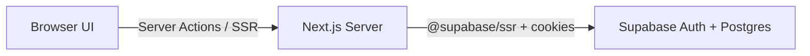

# DriveEase — Car Rental Web Application

**A Next.js Full-Stack Application with Supabase Auth and PostgreSQL Backend**

---

**Submitted by:** [Student Name]  
**Registration No.:** [Registration Number]  
**Department:** [Department Name]  
**Institution:** [College Name]  
**Academic Year:** [Academic Year]

---

## DECLARATION

I, **[Student Name]**, hereby declare that the project work entitled **"DriveEase — Car Rental Web Application"** submitted to **[College Name]** is a record of an original work done by me under the guidance of **[Guide Name]**, and this work has not been submitted elsewhere for the award of any degree or diploma.

**Place:** [Place]  
**Date:** [Date]  
**Signature:** ___________________

---

## ACKNOWLEDGEMENT

I would like to express my sincere gratitude to my project guide, **[Guide Name]**, for their valuable guidance, encouragement, and support throughout the development of this project.

I am thankful to **[College Name]** and the faculty of **[Department Name]** for providing the resources and environment needed to complete this work.

I also extend my thanks to my family and friends for their constant motivation during this project.

---

## INDEX

| S.No | Section | Page |
|------|---------|------|
| 1 | Declaration | |
| 2 | Acknowledgement | |
| 3 | Index | |
| 4 | Abstract | |
| 5 | Introduction | |
| 5.1 | Background | |
| 5.2 | Problem Statement | |
| 5.3 | Objectives | |
| 5.4 | Scope of the Project | |
| 6 | System Analysis | |
| 6.1 | Existing System | |
| 6.2 | Proposed System | |
| 6.3 | User Roles | |
| 6.4 | Feasibility Study | |
| 7 | System Specification | |
| 7.1 | Hardware Requirements | |
| 7.2 | Software Requirements | |
| 7.3 | Functional Requirements | |
| 7.4 | Non-Functional Requirements | |
| 8 | Software Description | |
| 8.1 | Technology Stack | |
| 8.2 | System Architecture | |
| 8.3 | Key Modules | |
| 9 | Project Description | |
| 9.1 | Application Routes | |
| 9.2 | Data Model | |
| 9.3 | Phase-wise Implementation | |
| 9.4 | Authentication and Security | |
| 9.5 | Booking System | |
| 9.6 | Admin Panel | |
| 10 | System Testing | |
| 10.1 | Unit Testing | |
| 10.2 | End-to-End Testing | |
| 10.3 | Manual Test Checklist | |
| 11 | System Implementation | |
| 11.1 | Installation and Setup | |
| 11.2 | Project Structure | |
| 11.3 | Build and Deployment | |
| 12 | Conclusion and Future Enhancement | |
| 13 | Appendix | |
| 14 | Bibliography and References | |

---

## ABSTRACT

DriveEase is a web-based car rental application built with Next.js 14 (App Router) and Supabase as the backend platform. The system allows visitors to browse a catalog of rental cars, apply filters by name, fuel type, seats, and price, and view detailed car information. Registered users authenticate with Supabase Auth, book cars by selecting pickup and return dates, and view their booking history. Administrators access a dedicated panel to view dashboard statistics, manage the car fleet (create, update, delete), and update booking statuses.

The application uses TypeScript for type safety, Tailwind CSS and shadcn/ui for responsive UI components, and Supabase PostgreSQL for persistent storage of cars, bookings, and user profiles. Authentication is implemented using Supabase Auth with `@supabase/ssr` for server-side session management, HTTP-only cookies, and middleware-based route protection. Row Level Security (RLS) policies enforce user and admin access at the database layer. All data fetching and mutations run on the Next.js server via Server Components and Server Actions.

The application demonstrates a complete product flow from catalog browsing through real authentication, database-backed booking, and administration. It supports local development and deployment to platforms such as Vercel with environment-based Supabase configuration.

---

## INTRODUCTION

### 5.1 Background

The car rental industry increasingly relies on digital platforms to manage fleet inventory, accept online bookings, and provide customers with self-service access to vehicle information and reservations. Web applications offer centralized catalogs, role-based access for staff and customers, and automated price calculation based on rental duration.

Modern full-stack frameworks such as Next.js, combined with Backend-as-a-Service platforms like Supabase, enable rapid development of production-style applications with real authentication, PostgreSQL databases, and server-side security policies.

### 5.2 Problem Statement

Traditional car rental operations often depend on manual phone bookings, paper records, and disconnected systems for fleet management. Customers lack a unified interface to browse available vehicles, compare prices, and track their reservations. Administrators need a single dashboard to monitor bookings and maintain the car catalog.

There is a need for a structured web application that demonstrates the core flows of an online car rental service: catalog discovery, user authentication, booking management, and administrative control — backed by a real database and authentication system rather than mock file storage.

### 5.3 Objectives

The primary objectives of the DriveEase project are:

1. Build a responsive web application shell with navigation, home page, and mobile-friendly layout (Phase 1).
2. Implement a car catalog with search and filter capabilities and individual car detail pages (Phase 2).
3. Provide Supabase Auth login with user and admin roles, session cookies, and protected routes (Phase 3).
4. Enable authenticated users to create bookings with date selection and automatic price calculation, and view their booking history (Phase 4).
5. Deliver an admin panel with dashboard statistics, cars CRUD, and booking status management (Phase 5).
6. Apply UX polish including loading skeletons, error pages, toast notifications, and empty states (Phase 6).
7. Integrate Supabase PostgreSQL for cars, bookings, and profiles with RLS policies and server-side data access (Backend Integration).

### 5.4 Scope of the Project

DriveEase is a full-stack car rental web application. Data is stored in Supabase PostgreSQL tables (`cars`, `bookings`, `profiles`) with Row Level Security. User authentication is handled by Supabase Auth with seeded demo accounts for development. The application does not integrate payment gateways or email notifications. It runs locally with `npm run dev` and can be deployed to Vercel with Supabase environment variables.

---

## SYSTEM ANALYSIS

### 6.1 Existing System

In a conventional manual car rental setup, customers contact the agency by phone or in person to inquire about vehicle availability. Staff maintain records in spreadsheets or paper logs. Pricing is calculated manually. There is no self-service portal for customers to browse the fleet or view past bookings. Administrative tasks such as adding new vehicles or updating availability require direct database or spreadsheet edits without a unified UI.

### 6.2 Proposed System

DriveEase replaces the manual workflow with a single web application backed by Supabase:

- **Public catalog:** Visitors browse cars at `/cars`, filter by criteria, and view details at `/cars/[id]`. Car data is loaded from the Supabase `cars` table on the server.
- **User portal:** Logged-in users book cars at `/cars/[id]/book` and view reservations at `/my-bookings`. Bookings are stored in Supabase with the authenticated user's UUID.
- **Admin portal:** Administrators manage the fleet and bookings at `/admin/dashboard`, `/admin/cars`, and `/admin/bookings`. Admin role is enforced via JWT `app_metadata.role` and RLS policies.

Data flows from UI components through Server Components and Server Actions to Supabase PostgreSQL. Middleware refreshes the Supabase session and enforces authentication and role-based access before pages render.

### 6.3 User Roles

| Role | Description | Access |
|------|-------------|--------|
| Visitor | Unauthenticated user | Home, car catalog, car detail (browse only) |
| User | Authenticated customer | All visitor routes plus booking and my bookings |
| Admin | Fleet manager | All user routes plus admin dashboard, cars CRUD, booking management |

**User flow (customer):** Home → Cars → Car Detail → Login (if needed) → Book → My Bookings

**User flow (admin):** Login → Admin Dashboard → Cars / Bookings management

### 6.4 Feasibility Study

- **Technical feasibility:** Next.js 14, React 18, TypeScript, and Supabase provide a mature full-stack ecosystem. PostgreSQL with RLS supports secure multi-role access. Server-side Supabase client (`@supabase/ssr`) integrates with Next.js middleware and Server Actions.
- **Operational feasibility:** Seeded demo credentials allow immediate testing. Admin and user roles share a single login page with role-based redirect after Supabase Auth sign-in.
- **Economic feasibility:** Next.js, React, Tailwind, Vitest, and Playwright are open source. Supabase offers a free tier suitable for development and academic deployment.

---

## SYSTEM SPECIFICATION

### 7.1 Hardware Requirements

| Component | Minimum Requirement |
|-----------|---------------------|
| Processor | Dual-core CPU or equivalent |
| RAM | 4 GB (8 GB recommended) |
| Storage | 500 MB free disk space for project and dependencies |
| Display | 1280×720 or higher resolution |
| Network | Internet connection for npm install, Supabase API, and external car images |

### 7.2 Software Requirements

| Software | Version |
|----------|---------|
| Node.js | 18+ (20 recommended) |
| npm | Bundled with Node.js |
| Supabase | Cloud project (PostgreSQL + Auth) |
| Operating System | Windows, macOS, or Linux |
| Web Browser | Chrome, Firefox, Edge, or Safari (latest) |
| Code Editor | VS Code or equivalent (optional) |

### 7.3 Functional Requirements

| Phase | Requirement | Status |
|-------|-------------|--------|
| 1 | Navbar, Footer, mobile hamburger nav, home hero with Browse Cars CTA | Implemented |
| 2 | Car catalog from Supabase, grid listing, search/filter, car detail page | Implemented |
| 3 | Supabase Auth login, session cookies, middleware guards, AuthProvider | Implemented |
| 4 | Booking form with dates, price calculation, my bookings page | Implemented |
| 5 | Admin dashboard, cars CRUD, booking status updates | Implemented |
| 6 | Loading skeletons, 404 page, Sonner toasts, empty states, README | Implemented |
| Backend | Supabase Postgres schema, RLS, seed script, server-side data layer | Implemented |

### 7.4 Non-Functional Requirements

- **Responsive design:** Layout adapts to mobile, tablet, and desktop viewports using Tailwind CSS breakpoints.
- **Role-based access control:** Middleware, layout guards, and Supabase RLS restrict admin and booking routes.
- **Server-side data access:** All Supabase queries run on the Next.js server; the browser never calls the database directly.
- **Server-side validation:** Booking dates, credentials, and admin mutations are validated on the server.
- **Accessibility:** Semantic HTML, ARIA attributes on navigation, and keyboard-friendly forms.

---

## SOFTWARE DESCRIPTION

### 8.1 Technology Stack

| Layer | Technology | Purpose |
|-------|------------|---------|
| Framework | Next.js 14.2 (App Router) | Routing, SSR, Server Actions |
| Language | TypeScript 5 | Static typing |
| UI Library | React 18 | Component-based UI |
| Styling | Tailwind CSS 3.4 | Utility-first CSS |
| Components | shadcn/ui | Button, Card, Table, Sheet, etc. |
| Notifications | Sonner | Toast messages |
| Backend | Supabase | PostgreSQL database + Auth |
| Supabase Client | @supabase/ssr, @supabase/supabase-js | Server-side session and queries |
| Unit Tests | Vitest 2.1 | Library function tests |
| E2E Tests | Playwright 1.59 | Browser automation tests |
| Deployment | Vercel (optional) | Hosting with env-based Supabase config |

### 8.2 System Architecture

The application follows a layered architecture:

1. **Presentation layer (`app/` + `components/`):** Pages, layouts, and reusable UI components. Client components handle forms and in-memory filtering only.
2. **Business logic layer (`lib/`):** Authentication helpers, Supabase data access, booking calculations.
3. **Supabase layer (`lib/supabase/`):** Server client, middleware session refresh, admin client for seeding.
4. **Data layer (Supabase PostgreSQL):** Tables `profiles`, `cars`, `bookings` with RLS policies.
5. **Security layer (`middleware.ts` + RLS):** Route protection, session refresh, and database-level access control.



Server Actions in `app/actions/` handle mutations (login, logout, create booking, admin CRUD) by calling Supabase on the server with the user's session cookie.

### 8.3 Key Modules

| Module | Path | Responsibility |
|--------|------|----------------|
| Auth | `lib/auth.ts` | Map Supabase user to session payload, get current user |
| Supabase server | `lib/supabase/server.ts` | Create server Supabase client with cookies |
| Supabase middleware | `lib/supabase/middleware.ts` | Refresh auth session in middleware |
| Supabase admin | `lib/supabase/admin.ts` | Service-role client for seed script only |
| Data (read) | `lib/data.ts` | Async car listing and get-by-ID from Supabase |
| Car catalog (pure) | `lib/car-catalog.ts` | Client-safe filter helpers and Car type |
| Cars store (write) | `lib/cars-store.ts` | Admin car CRUD via Supabase |
| Bookings | `lib/bookings.ts` | Read/write bookings, joins with cars and profiles |
| Booking math | `lib/booking-math.ts` | Rental days and total price calculation |
| Admin auth | `lib/admin-auth.ts` | Layout-level admin guard |
| Middleware | `middleware.ts` | Session refresh, login redirect, route protection |
| Seed script | `scripts/seed-supabase.ts` | Seed demo users, cars, and bookings |

---

## PROJECT DESCRIPTION

### 9.1 Application Routes

| Route | Access | Description |
|-------|--------|-------------|
| `/` | Public | Home page with hero and Browse Cars button |
| `/cars` | Public | Car catalog with search and filters (data from Supabase) |
| `/cars/[id]` | Public | Car detail with gallery and Book Now |
| `/cars/[id]/book` | Authenticated user | Booking form with date pickers |
| `/login` | Public | Email/password login via Supabase Auth |
| `/my-bookings` | Authenticated user | Table of user's bookings from Supabase |
| `/admin/dashboard` | Admin | Statistics and quick actions |
| `/admin/cars` | Admin | Cars list, create, edit, delete |
| `/admin/bookings` | Admin | All bookings with status dropdown |

### 9.2 Data Model

**Supabase Auth (`auth.users`):**
- Managed by Supabase Auth; demo users seeded with `app_metadata.role` (`user` | `admin`)

**Profile (`public.profiles`):**
- id (uuid, FK → auth.users), name, email, created_at

**Car (`public.cars`):**
- id (bigserial), name, seats, fuel, price (per day), available (boolean), images (text[]), description

**Booking (`public.bookings`):**
- id (bigserial), user_id (uuid → auth.users), car_id (bigint → cars), pickup_date, return_date, total_price, status (confirmed | pending | completed | cancelled)

Relationships: User (auth.users) has one Profile; User places many Bookings; Car appears in many Bookings.

**RLS policies:**
- `cars`: public SELECT; admin INSERT/UPDATE/DELETE
- `bookings`: users SELECT/INSERT own rows; admin SELECT/UPDATE all
- `profiles`: users read/update own row; admin read all

### 9.3 Phase-wise Implementation

**Phase 1 — Layout shell:** Root layout wraps all pages with Navbar, Footer, AuthProvider, and Sonner toast provider. Mobile navigation uses shadcn Sheet component.

**Phase 2 — Catalog:** `CarsCatalog` component renders a responsive grid of `CarCard` components. Cars are fetched server-side from Supabase. Filters include name search, fuel type, seats, and maximum price (client-side on fetched data).

**Phase 3 — Authentication:** Single `/login` page calls `supabase.auth.signInWithPassword`. Supabase session stored in HTTP-only cookies via `@supabase/ssr`. Users redirect to `/`; admins redirect to `/admin/dashboard`. Navbar shows user name and logout when authenticated.

**Phase 4 — Booking:** Dedicated `/cars/[id]/book` page hosts `CarBookingForm` with native date inputs. Total price = billable rental days × car price per day. `createBookingAction` inserts into Supabase `bookings` and redirects to `/my-bookings?booked=1`.

**Phase 5 — Admin:** Admin layout with sidebar navigation. Dashboard shows total cars, available cars, total bookings from Supabase counts. Cars page supports create/edit/delete. Bookings page lists all reservations with status update dropdown.

**Phase 6 — Polish:** Loading skeletons on `/cars` and `/cars/[id]`. Custom `not-found.tsx` for 404 errors. Toast components for login, booking success, and admin mutations. Empty states on catalog filter and my bookings.

**Backend Integration — Supabase:** Migrated from JSON file storage to Supabase PostgreSQL. Added migrations in `supabase/migrations/`, RLS policies, seed script, and server-side Supabase client helpers. Removed custom HMAC session tokens and filesystem data writes.

### 9.4 Authentication and Security

- **Supabase Auth** handles email/password sign-in and sign-out.
- **`@supabase/ssr`** manages session cookies on the Next.js server and in middleware.
- **Admin role** stored in `auth.users.raw_app_meta_data.role` (not user-editable `user_metadata`).
- **Middleware** refreshes session and enforces route access before pages render.
- **RLS** enforces database access: users see only their bookings; admins manage cars and all bookings.
- **Anon key** used on server with user session — service role key used only for local seeding, never exposed to the browser.

**Demo credentials (seeded):**
- User: user@gmail.com / 123456
- Admin: admin@gmail.com / admin123

**Environment variables:**
- `NEXT_PUBLIC_SUPABASE_URL` — Supabase project URL
- `NEXT_PUBLIC_SUPABASE_ANON_KEY` — public anon key for server/client SSR
- `SUPABASE_SERVICE_ROLE_KEY` — local seed script only (not required on Vercel)

### 9.5 Booking System

Booking creation flow:
1. User selects pickup and return dates on the booking form.
2. `billableRentalDays` calculates inclusive rental days from date range.
3. `computeBookingTotal` multiplies days by car's daily price.
4. Server Action validates dates, car availability, and Supabase session.
5. New booking inserted into Supabase `bookings` with `user_id` from authenticated session and status "confirmed".
6. User redirected to my bookings with success toast.

### 9.6 Admin Panel

- **Dashboard:** Cards for total cars, available cars, total bookings; latest booking summary; links to cars and bookings pages.
- **Cars management:** Table listing all cars from Supabase; form to add new car; edit via query parameter form; delete with browser confirm dialog. Changes reflect immediately on the public catalog (single Supabase data source).
- **Bookings management:** Table with user name, email, car name, dates, total, status; dropdown to update status via Server Action.

---

## SYSTEM TESTING

### 10.1 Unit Testing

Vitest runs unit tests for core library functions:

| Test File | Coverage |
|-----------|----------|
| `lib/data.test.ts` | filterCars, distinct fuels/seats (pure helpers) |
| `lib/bookings.test.ts` | billableRentalDays, computeBookingTotal |

Run with: `npm run test`

### 10.2 End-to-End Testing

Playwright e2e specs cover critical user journeys against a Supabase-backed deployment:

| Spec File | Coverage |
|-----------|----------|
| `e2e/home.spec.ts` | Hero, CTA, navbar links |
| `e2e/cars.spec.ts` | 10 cars displayed, search/filter, empty state |
| `e2e/car-detail.spec.ts` | Metadata, Book CTA, unavailable car, 404 |
| `e2e/login.spec.ts` | Form, invalid credentials, user callback, admin redirect |
| `e2e/auth-guard.spec.ts` | Guards on my-bookings, admin, book route |
| `e2e/bookings.spec.ts` | Seeded bookings list, create booking flow |
| `e2e/admin.spec.ts` | Non-admin blocked, dashboard, car CRUD, status update |
| `e2e/phase6.spec.ts` | Custom 404, login error feedback |

Run with: `npm run seed` (fresh Supabase project), then `npm run test:e2e`

### 10.3 Manual Test Checklist

1. Configure `.env.local` with Supabase URL and anon key; run `npm run seed`.
2. Open home page; click Browse Cars; verify 10 cars load from Supabase.
3. Filter by fuel type and price; verify results update.
4. Open car detail; click Book Now while logged out; verify redirect to login.
5. Log in as user@gmail.com; complete a booking; verify my bookings page.
6. Log out; log in as admin@gmail.com; verify redirect to admin dashboard.
7. Add, edit, and delete a car in admin cars page; verify catalog updates.
8. Update a booking status in admin bookings page.
9. Visit invalid URL; verify custom 404 page.

---

## SYSTEM IMPLEMENTATION

### 11.1 Installation and Setup

```bash
# Clone or navigate to project directory
cd car-rental

# Install dependencies
npm install

# Copy environment template and fill in Supabase keys
cp .env.local.example .env.local

# Apply migrations (Supabase SQL editor or CLI), then seed demo data
npm run seed

# Start development server
npm run dev
```

Open http://localhost:3000 in a browser.

**Supabase setup:**
1. Create a Supabase project at https://supabase.com
2. Run SQL from `supabase/migrations/` in the SQL editor
3. Add project URL, anon key, and service role key to `.env.local`
4. Run `npm run seed` to create demo users, cars, and bookings

### 11.2 Project Structure

```
car-rental/
├── app/                    # Next.js App Router pages and layouts
│   ├── actions/            # Server Actions (auth, booking, admin)
│   ├── admin/              # Admin panel routes
│   ├── cars/               # Catalog and detail routes
│   ├── login/              # Login page
│   └── my-bookings/        # User bookings page
├── components/             # React components
│   ├── admin/              # Admin-specific components
│   ├── providers/          # Auth and toast providers
│   └── ui/                 # shadcn UI primitives
├── lib/                    # Business logic and Supabase access
│   └── supabase/           # Server, middleware, admin clients
├── scripts/                # Seed script and seed data
│   └── seed-data/          # JSON source for npm run seed
├── supabase/migrations/    # Postgres schema and RLS SQL
├── e2e/                    # Playwright end-to-end tests
├── projectplan/            # Phase documentation
├── docs/                   # Project reports
└── middleware.ts           # Session refresh and route protection
```

### 11.3 Build and Deployment

```bash
# Lint
npm run lint

# Production build
npm run build

# Start production server
npm start
```

**Vercel deployment:**
1. Import the GitHub repository into Vercel
2. Set environment variables: `NEXT_PUBLIC_SUPABASE_URL`, `NEXT_PUBLIC_SUPABASE_ANON_KEY`
3. In Supabase Auth settings, add the Vercel site URL to allowed redirect URLs
4. Deploy — no service role key needed on Vercel for normal operation

---

## CONCLUSION AND FUTURE ENHANCEMENT

### Conclusion

DriveEase successfully implements a full-stack car rental application across six development phases plus Supabase backend integration. The application delivers a complete customer journey from browsing the fleet through authenticated booking and viewing reservations, as well as a full admin workflow for fleet and booking management. The migration from JSON file storage to Supabase PostgreSQL with real authentication demonstrates production-style architecture suitable for academic project presentation and cloud deployment.

Unit and end-to-end tests provide automated verification of core functionality. UX polish items including loading states, toast notifications, and empty states improve the demonstration quality of the application.

### Future Enhancements

1. **User registration:** Add sign-up page and email confirmation flow via Supabase Auth.
2. **Payment gateway:** Integrate Stripe or Razorpay for online payment at booking time.
3. **Email notifications:** Send booking confirmation and reminder emails via Supabase Edge Functions or a transactional email provider.
4. **Availability calendar:** Block dates when cars are already booked using date-range queries.
5. **Image upload:** Use Supabase Storage for admin car photo uploads instead of external URLs.
6. **OAuth providers:** Add Google or GitHub login via Supabase Auth.
7. **CI/CD pipeline:** Automated tests and deployment on pull requests.

---

## APPENDIX

### Appendix A — Route Protection Map

| Route Pattern | Visitor | User | Admin |
|---------------|---------|------|-------|
| `/`, `/cars`, `/cars/[id]` | Yes | Yes | Yes |
| `/login` | Yes | Redirect if logged in | Redirect if logged in |
| `/cars/[id]/book` | Redirect to login | Yes | Yes |
| `/my-bookings` | Redirect to login | Yes | Yes |
| `/admin/*` | Redirect to login | Redirect to home | Yes |

### Appendix B — Database Schema (Supabase PostgreSQL)

**profiles**
```sql
id uuid PRIMARY KEY REFERENCES auth.users(id)
name text NOT NULL
email text
created_at timestamptz DEFAULT now()
```

**cars**
```sql
id bigserial PRIMARY KEY
name text NOT NULL
seats integer NOT NULL
fuel text NOT NULL
price integer NOT NULL
available boolean DEFAULT true
images text[] NOT NULL
description text NOT NULL
```

**bookings**
```sql
id bigserial PRIMARY KEY
user_id uuid REFERENCES auth.users(id)
car_id bigint REFERENCES cars(id)
pickup_date date NOT NULL
return_date date NOT NULL
total_price integer NOT NULL
status text CHECK (status IN ('confirmed','pending','completed','cancelled'))
created_at timestamptz DEFAULT now()
```

### Appendix C — Environment Variables

| Variable | Required | Purpose |
|----------|----------|---------|
| `NEXT_PUBLIC_SUPABASE_URL` | Yes | Supabase project URL |
| `NEXT_PUBLIC_SUPABASE_ANON_KEY` | Yes | Server-side Supabase client |
| `SUPABASE_SERVICE_ROLE_KEY` | Seed only | Local `npm run seed` script |

### Appendix D — Screenshot Placeholders

Insert screenshots captured from http://localhost:3000 or Vercel deployment:

1. Home page — hero section with Browse Cars button
2. Cars listing — grid with filters
3. Car detail — gallery and Book Now button
4. Login page — email and password form
5. My Bookings — user booking table
6. Admin Dashboard — statistics cards

### Appendix E — npm Scripts Reference

| Command | Description |
|---------|-------------|
| `npm run dev` | Start development server |
| `npm run build` | Production build |
| `npm start` | Start production server |
| `npm run lint` | Run ESLint |
| `npm run test` | Run Vitest unit tests |
| `npm run seed` | Seed Supabase demo users, cars, bookings |
| `npm run test:e2e` | Run Playwright e2e tests |

---

## BIBLIOGRAPHY & REFERENCES

1. Next.js Documentation — https://nextjs.org/docs
2. React Documentation — https://react.dev
3. TypeScript Documentation — https://www.typescriptlang.org/docs
4. Supabase Documentation — https://supabase.com/docs
5. Supabase Auth with Next.js — https://supabase.com/docs/guides/auth/server-side/nextjs
6. Tailwind CSS Documentation — https://tailwindcss.com/docs
7. shadcn/ui — https://ui.shadcn.com
8. Sonner Toast Library — https://sonner.emilkowal.ski
9. Vitest — https://vitest.dev
10. Playwright — https://playwright.dev
11. Vercel Deployment — https://vercel.com/docs
12. MDN Web Docs — https://developer.mozilla.org
