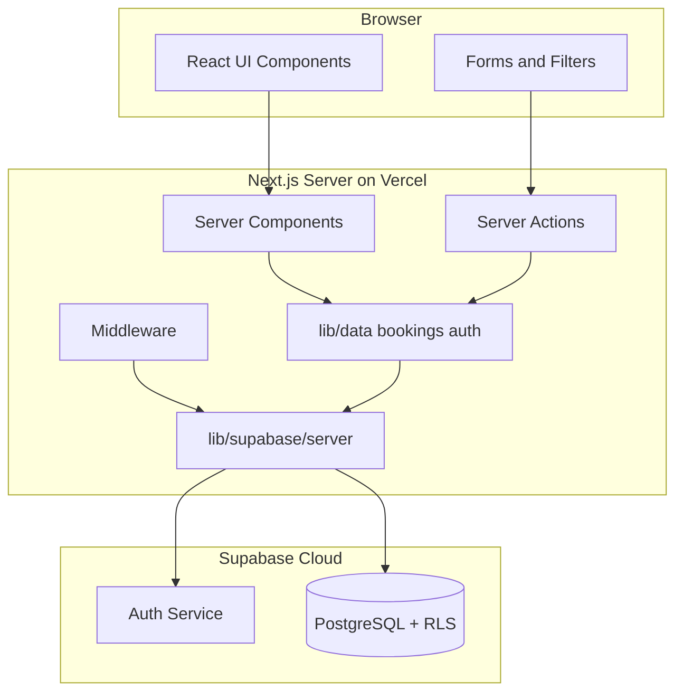
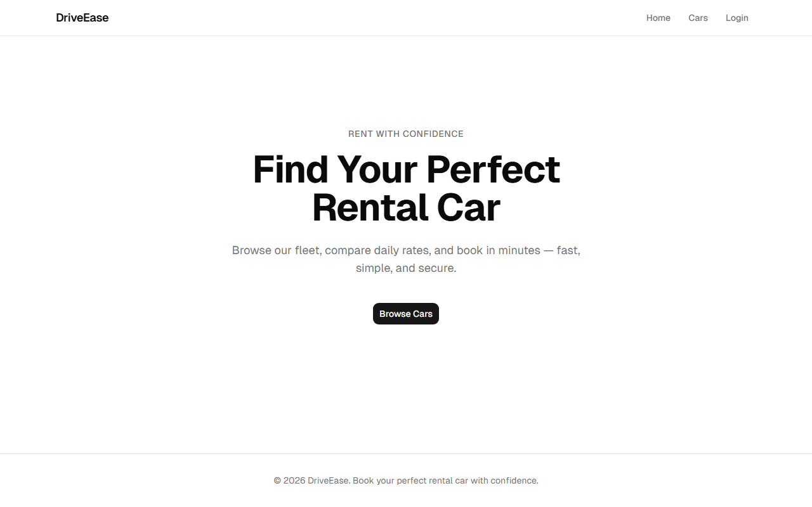
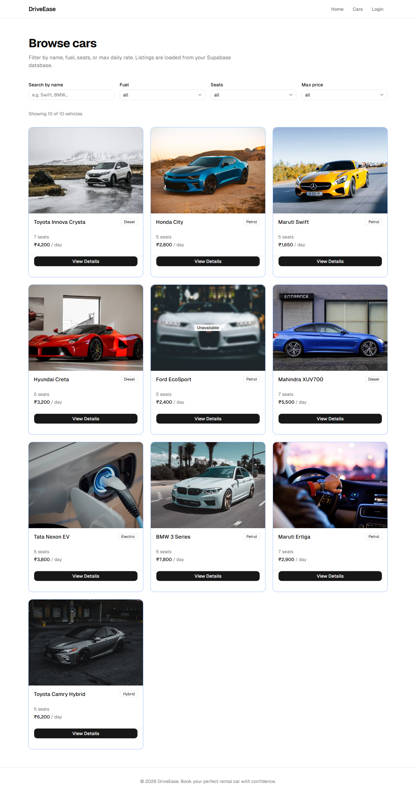
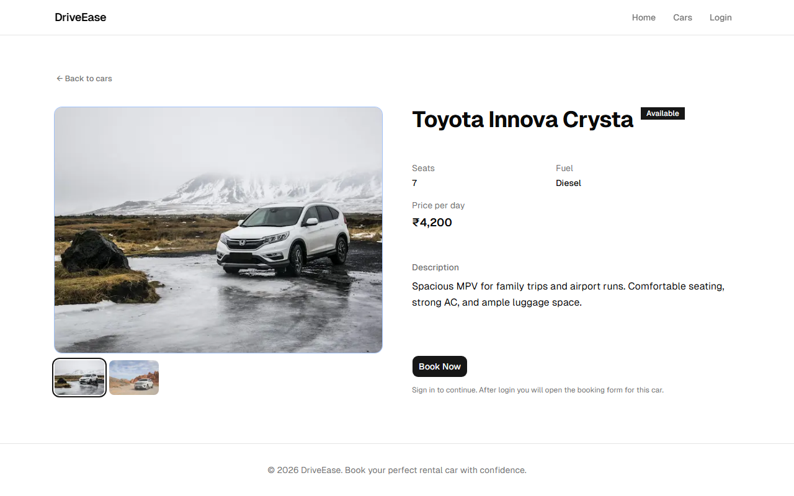
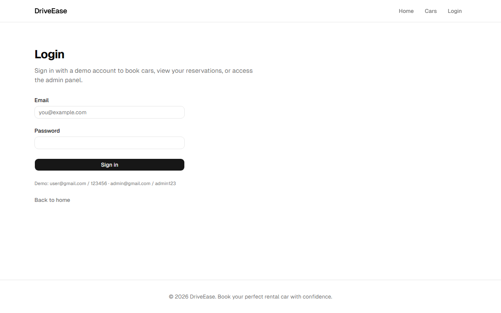
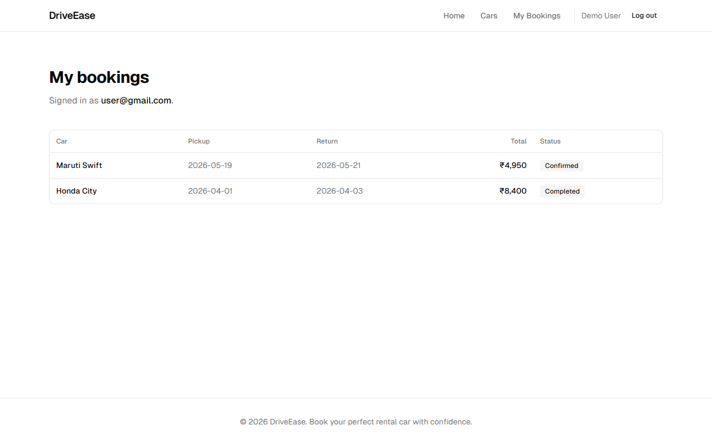
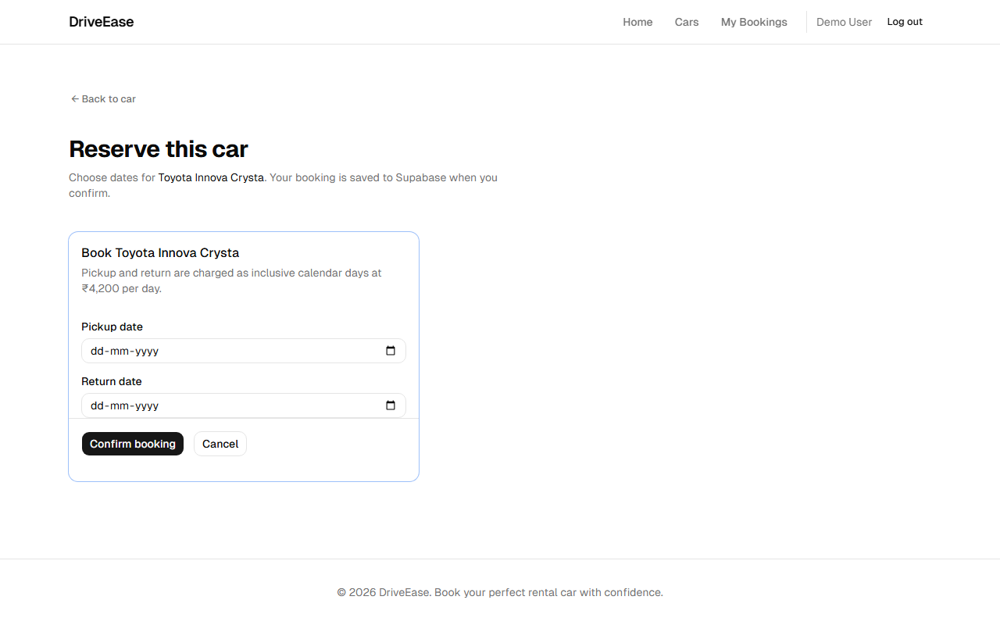
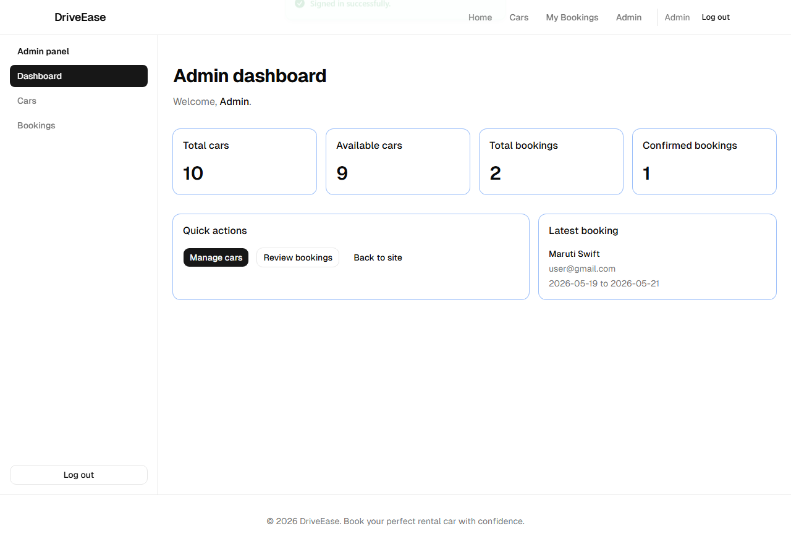
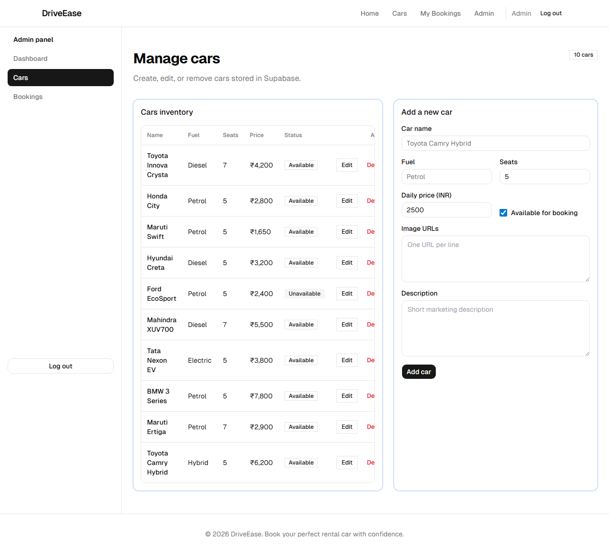
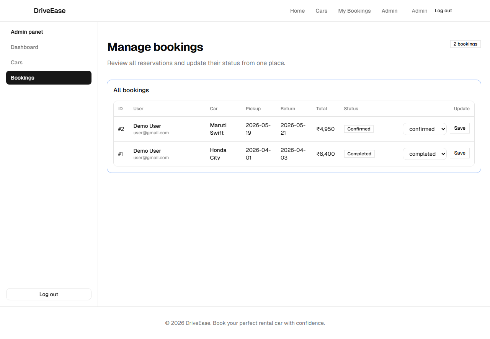

# DriveEase — Car Rental Web Application

**A Next.js Full-Stack Application with Supabase Auth and PostgreSQL Backend**

---

**Submitted by:** [Student Name]  
**Registration No.:** [Registration Number]  
**Department:** [Department Name]  
**Institution:** [College Name]  
**Academic Year:** [Academic Year]

---

## DECLARATION

I, **[Student Name]**, hereby declare that the project work entitled **"DriveEase — Car Rental Web Application"** submitted to **[College Name]** is a record of an original work done by me under the guidance of **[Guide Name]**, and this work has not been submitted elsewhere for the award of any degree or diploma.

**Place:** [Place]  
**Date:** [Date]  
**Signature:** ___________________

---

## ACKNOWLEDGEMENT

I would like to express my sincere gratitude to my project guide, **[Guide Name]**, for their valuable guidance, encouragement, and support throughout the development of this project. Their feedback on system design, database schema, and security practices helped shape the final architecture of DriveEase.

I am thankful to **[College Name]** and the faculty of **[Department Name]** for providing the resources, laboratory facilities, and academic environment needed to complete this work. I also acknowledge the open-source communities behind Next.js, React, Supabase, and the tooling used in this project.

I extend my thanks to my family and friends for their constant motivation, patience, and encouragement during the development and documentation of this project.

---

## INDEX

| S.No | Section | Page |
|------|---------|------|
| 1 | Declaration | |
| 2 | Acknowledgement | |
| 3 | Index | |
| 4 | Abstract | |
| 5 | Introduction | |
| 5.1 | Background | |
| 5.2 | Problem Statement | |
| 5.3 | Objectives | |
| 5.4 | Scope of the Project | |
| 5.5 | Key Features and System Capabilities | |
| 6 | System Analysis | |
| 6.1 | Existing System | |
| 6.2 | Proposed System | |
| 6.3 | User Roles | |
| 6.4 | Feasibility Study | |
| 6.5 | Context Diagram and Data Flow | |
| 7 | System Specification | |
| 7.1 | Hardware Requirements | |
| 7.2 | Software Requirements | |
| 7.3 | Functional Requirements | |
| 7.4 | Non-Functional Requirements | |
| 7.5 | Constraints and Assumptions | |
| 8 | Software Description | |
| 8.1 | Technology Stack | |
| 8.2 | System Architecture | |
| 8.3 | Key Modules | |
| 8.4 | Server-Side vs Client-Side Responsibilities | |
| 8.5 | Server Actions Reference | |
| 9 | Project Description | |
| 9.1 | Application Routes | |
| 9.2 | Data Model and Entity Relationships | |
| 9.3 | Application Modules and Features | |
| 9.4 | Authentication and Security | |
| 9.5 | Booking System | |
| 9.6 | Admin Panel | |
| 9.7 | Supabase Backend Architecture | |
| 9.8 | Database Schema and Row Level Security | |
| 9.9 | User Interface Components | |
| 9.10 | Validation, Error Handling, and Edge Cases | |
| 10 | System Testing | |
| 10.1 | Unit Testing | |
| 10.2 | End-to-End Testing | |
| 10.3 | Manual Test Checklist | |
| 10.4 | Sample Test Cases | |
| 11 | System Implementation | |
| 11.1 | Installation and Setup | |
| 11.2 | Project Structure | |
| 11.3 | Build and Deployment | |
| 11.4 | Supabase Project Setup (Step-by-Step) | |
| 11.5 | Vercel Deployment Guide | |
| 11.6 | Network Privacy (Browser vs Server) | |
| 11.7 | Source Code Repository | |
| 12 | Conclusion and Future Enhancement | |
| 13 | Appendix | |
| 13.1 | Appendix G — Application Screenshots | |
| 13.2 | Appendix J — Source Code Listing | |
| 14 | Bibliography and References | |

---

## ABSTRACT

DriveEase is a web-based car rental application built with Next.js 14 (App Router) and Supabase as the backend platform. The system allows visitors to browse a catalog of rental cars, apply filters by name, fuel type, seats, and price, and view detailed car information including image galleries and daily rental rates. Registered users authenticate through Supabase Auth using email and password, book cars by selecting pickup and return dates, and view their complete booking history in a personal dashboard. Administrators access a dedicated panel to view real-time dashboard statistics, manage the entire car fleet through create-read-update-delete operations, and update booking statuses across all customers.

The application uses TypeScript for compile-time type safety, Tailwind CSS and shadcn/ui for a responsive and accessible user interface, and Supabase PostgreSQL for persistent storage of cars, bookings, and user profiles. Authentication is implemented using Supabase Auth with the `@supabase/ssr` package for server-side session management, HTTP-only cookies, and middleware-based route protection. Row Level Security (RLS) policies enforce user and admin access at the database layer, ensuring that even if application logic fails, unauthorized data access is blocked by PostgreSQL itself.

All data fetching and mutations run exclusively on the Next.js server via Server Components and Server Actions. The client browser communicates only with the Next.js application; it does not make direct network requests to Supabase for database queries or authentication API calls. This architecture improves security by keeping database credentials and session handling on the server while still delivering a fast, interactive user experience through React client components for forms and filters.

The application supports local development, automated testing with Vitest and Playwright, and cloud deployment to Vercel with environment-based Supabase configuration. DriveEase is designed as a production-style full-stack web application suitable for academic evaluation, portfolio presentation, and live demonstration on a cloud-hosted URL.

---

## INTRODUCTION

### 5.1 Background

The car rental industry increasingly relies on digital platforms to manage fleet inventory, accept online bookings, and provide customers with self-service access to vehicle information and reservations. Customers expect to browse available vehicles online, compare specifications and prices, and complete bookings without visiting a physical office. Rental agencies, in turn, require centralized systems to track fleet availability, manage reservations, and assign administrative roles to staff members.

Web applications built with modern full-stack frameworks address these needs by combining server-side rendering for performance and SEO with rich client-side interactivity for search, filtering, and form submission. Next.js 14 with the App Router provides Server Components, Server Actions, and middleware in a unified framework. Supabase complements this stack by offering managed PostgreSQL, built-in authentication, and Row Level Security without requiring a separate custom backend server.

DriveEase is a full-stack car rental web application that models these industry patterns: a catalog of ten vehicles, two user roles (customer and administrator), and a complete booking lifecycle from discovery through confirmation and admin status updates.

### 5.2 Problem Statement

Traditional car rental operations often depend on manual phone bookings, paper records, and disconnected spreadsheets for fleet management. Customers lack a unified interface to browse available vehicles, compare prices across fuel types and seating capacities, and track their past and upcoming reservations. Administrators must manually reconcile booking records, update vehicle availability, and maintain pricing information across multiple disconnected tools.

There is a clear need for a structured web application that demonstrates the core flows of an online car rental service: catalog discovery, secure user authentication, database-backed booking management, and administrative control — backed by Supabase PostgreSQL and deployable to a cloud hosting platform such as Vercel.

### 5.3 Objectives

The primary objectives of the DriveEase project are:

1. **Application shell:** Build a responsive web application with navigation, footer, home page hero section, and mobile-friendly hamburger navigation.
2. **Vehicle catalog:** Implement a car listing page with search and filter capabilities, individual car detail pages with image galleries, and pricing display in Indian Rupees (INR), with data stored in Supabase PostgreSQL.
3. **Authentication:** Provide Supabase Auth login with distinct user and admin roles, HTTP-only session cookies, middleware route guards, and React context for displaying the signed-in user in the navbar.
4. **Booking workflow:** Enable authenticated users to create bookings with date selection, automatic inclusive-day price calculation, and a personal booking history page persisted in Supabase.
5. **Administration:** Deliver an admin panel with dashboard statistics, full cars CRUD, and booking status management for all reservations in the system.
6. **User experience:** Apply loading skeletons, custom 404 page, Sonner toast notifications for user feedback, and empty states when filters or booking lists return no results.
7. **Cloud-ready backend:** Use Supabase PostgreSQL with Row Level Security, server-side data access via `@supabase/ssr`, schema migrations, and a seed script for repeatable demo data.

Secondary objectives include automated unit testing of business logic, end-to-end browser testing of critical user journeys, comprehensive project documentation, and successful deployment to Vercel connected to a Supabase cloud project.

### 5.4 Scope of the Project

DriveEase is a full-stack car rental web application built for academic evaluation and live deployment. Data is stored in Supabase PostgreSQL tables (`profiles`, `cars`, `bookings`) protected by Row Level Security policies. User authentication is handled by Supabase Auth with seeded demo accounts for development and testing.

**In scope:**
- Public car catalog with client-side filtering on server-fetched data
- Supabase Auth email/password login for user and admin roles
- Booking creation with date validation and price calculation
- Admin dashboard, cars management, and booking status updates
- Server-side data access with `@supabase/ssr`
- Local development setup and Vercel deployment instructions
- Unit tests (Vitest) and end-to-end tests (Playwright)

**Out of scope:**
- User self-registration and email verification flows
- Payment gateway integration (Stripe, Razorpay, etc.)
- Email or SMS booking notifications
- Real-time availability calendar blocking overlapping bookings
- Supabase Storage for uploaded car images
- OAuth social login (Google, GitHub)
- Mobile native applications

The application runs locally with `npm run dev` and deploys to Vercel with two public environment variables pointing to a Supabase cloud project.

### 5.5 Key Features and System Capabilities

DriveEase delivers the following integrated capabilities in its final implemented version:

| Module | Capability | Technology |
|--------|------------|------------|
| Layout | Responsive navbar, footer, mobile navigation, home hero | Next.js, Tailwind CSS, shadcn/ui Sheet |
| Catalog | Ten-vehicle grid, search/filter, detail pages with galleries | Supabase `cars` table, Server Components |
| Authentication | Email/password login, role-based redirect, session cookies | Supabase Auth, `@supabase/ssr`, middleware |
| Booking | Date selection, price calculation, personal booking history | Supabase `bookings` table, Server Actions |
| Administration | Dashboard stats, cars CRUD, booking status management | Supabase RLS admin policies, Server Actions |
| Backend | PostgreSQL persistence, RLS, seed script, server-side queries | Supabase cloud, `lib/supabase/` helpers |

**Public catalog:** Any visitor can browse the full car fleet, apply filters, and view detailed specifications without signing in. Car data is always loaded from Supabase on the server, ensuring the catalog reflects the current database state including admin updates.

**Authenticated booking:** Signed-in users can reserve available vehicles by choosing pickup and return dates. Bookings are stored in Supabase with the user's UUID, and RLS ensures users can only view their own reservations.

**Admin control:** Administrators manage the entire fleet and all customer bookings through a dedicated panel. Role enforcement occurs at middleware, layout guards, Server Actions, and PostgreSQL RLS layers.

**Server-side integration:** All Supabase communication runs on the Next.js server. The browser interacts only with the application domain, not directly with Supabase API endpoints.

---

## SYSTEM ANALYSIS

### 6.1 Existing System

In a conventional manual car rental setup, customers contact the agency by phone or in person to inquire about vehicle availability. Staff maintain records in spreadsheets or paper logs, noting vehicle registration numbers, daily rates, and booking dates manually. Pricing is calculated by counting days on a calendar or mental arithmetic at the counter. There is no self-service portal for customers to browse the fleet, compare fuel types, or view past bookings independently.

Administrative tasks such as adding a new vehicle to the fleet, marking a car as unavailable for maintenance, or updating a booking from "confirmed" to "completed" require direct edits to backend records without a unified web interface. Multiple staff members editing the same spreadsheet can cause data conflicts. Security is limited to physical access control rather than role-based digital permissions.

### 6.2 Proposed System

DriveEase replaces the manual workflow with a single web application backed by Supabase:

- **Public catalog:** Visitors browse cars at `/cars`, filter by name, fuel, seats, and maximum price, and view rich detail pages at `/cars/[id]`. Car data is loaded from the Supabase `cars` table on the Next.js server during page render.
- **User portal:** Logged-in users navigate to `/cars/[id]/book` to select rental dates and confirm reservations. Completed bookings appear at `/my-bookings`. Each booking row is linked to the authenticated user's UUID in Supabase.
- **Admin portal:** Administrators access `/admin/dashboard` for aggregate statistics, `/admin/cars` for fleet CRUD, and `/admin/bookings` for reservation management. Admin privileges are determined by the `role` field in Supabase JWT `app_metadata` and enforced by both middleware and RLS policies.

Data flows from browser UI through Server Components and Server Actions to Supabase PostgreSQL. Middleware refreshes the Supabase auth session on each protected request and redirects unauthorized users before sensitive pages render.

### 6.3 User Roles

| Role | Description | Access |
|------|-------------|--------|
| Visitor | Unauthenticated user browsing the site | Home, car catalog (`/cars`), car detail (`/cars/[id]`) |
| User | Authenticated customer with Supabase Auth account | All visitor routes plus booking form and my bookings |
| Admin | Fleet manager with `app_metadata.role = admin` | All user routes plus admin dashboard, cars CRUD, all bookings |

**Customer journey:** Home → Browse Cars → View Car Detail → Login (if not signed in) → Select Dates → Confirm Booking → View My Bookings

**Administrator journey:** Login (admin credentials) → Admin Dashboard → Manage Cars / Manage Bookings → Logout

Role assignment for demo accounts is performed during seeding via the Supabase Admin API, which sets `app_metadata.role` to either `user` or `admin`. This field is not editable by the end user through the application interface.

### 6.4 Feasibility Study

**Technical feasibility:** Next.js 14, React 18, TypeScript, and Supabase together provide a mature, well-documented full-stack ecosystem. PostgreSQL with Row Level Security supports secure multi-role data access without custom authorization middleware in the database layer. The `@supabase/ssr` package integrates cleanly with Next.js middleware, Server Components, and Server Actions. All chosen technologies are actively maintained with extensive community support.

**Operational feasibility:** Seeded demo credentials (`user@gmail.com` and `admin@gmail.com`) allow immediate testing without a registration workflow. A single `npm run seed` command populates cars, users, and sample bookings in a fresh Supabase project. The same seed script can be re-run during development to reset demo data.

**Economic feasibility:** Next.js, React, Tailwind CSS, Vitest, and Playwright are open source. Supabase offers a free tier sufficient for development, academic projects, and low-traffic demonstrations. Vercel provides free hobby-tier hosting for Next.js applications. No paid licenses are required to run the complete system.

**Operational readiness:** The modular separation between presentation (`app/`, `components/`), business logic (`lib/`), and Supabase integration (`lib/supabase/`) allows independent testing of catalog filters, booking math, and admin mutations. Environment variables configure Supabase credentials for local development and Vercel production without code changes.

### 6.5 Context Diagram and Data Flow

At the highest level, three external entities interact with DriveEase:

1. **Visitor / User / Admin (Browser):** Sends HTTP requests to the Next.js application; receives HTML and JSON responses; submits forms via Server Actions.
2. **Next.js Application (Vercel or local):** Renders pages, executes Server Actions, refreshes auth sessions, queries Supabase.
3. **Supabase (Cloud):** Provides Auth service for login/session and PostgreSQL database for cars, bookings, and profiles.

**Typical read flow (car catalog):**
1. Browser requests `/cars`.
2. Next.js Server Component calls `getAllCars()` in `lib/data.ts`.
3. Server Supabase client queries `SELECT * FROM cars ORDER BY id`.
4. Supabase returns rows; server maps them to `Car` objects and renders HTML.
5. Browser displays the catalog; client-side `CarsCatalog` filters the already-fetched list in memory.

**Typical write flow (create booking):**
1. User submits booking form; browser POSTs to Next.js Server Action `createBookingAction`.
2. Server reads Supabase session from cookie; validates user is authenticated.
3. Server validates dates, car availability, and computes total price.
4. Server inserts row into `bookings` table with `user_id = auth.uid()`.
5. RLS policy confirms the insert is allowed; Supabase returns success.
6. Server redirects browser to `/my-bookings?booked=1`.

---

## SYSTEM SPECIFICATION

### 7.1 Hardware Requirements

| Component | Minimum Requirement | Recommended |
|-----------|---------------------|-------------|
| Processor | Dual-core CPU, 1.6 GHz | Quad-core CPU, 2.0 GHz or higher |
| RAM | 4 GB | 8 GB or higher |
| Storage | 500 MB free (project + node_modules) | 1 GB SSD free space |
| Display | 1280×720 resolution | 1920×1080 for admin table views |
| Network | Broadband internet connection | Stable connection for Supabase API and Vercel deploy |

### 7.2 Software Requirements

| Software | Version | Purpose |
|----------|---------|---------|
| Node.js | 18+ (20 recommended) | JavaScript runtime for Next.js |
| npm | Bundled with Node.js | Package management |
| Supabase | Cloud project | PostgreSQL database + Auth service |
| Git | 2.x | Version control |
| Operating System | Windows 10+, macOS 12+, or Linux | Development environment |
| Web Browser | Chrome, Firefox, Edge, Safari (latest) | Application testing |
| Code Editor | VS Code (optional) | Development with TypeScript support |
| Python 3 | 3.8+ (optional) | Regenerate Word report via `generate-project-doc.py` |

### 7.3 Functional Requirements

| ID | Module | Requirement | Status |
|----|--------|-------------|--------|
| FR-01 | Layout | Responsive navbar with brand, navigation links, and mobile sheet menu | Implemented |
| FR-02 | Layout | Footer with site information and consistent layout across pages | Implemented |
| FR-03 | Layout | Home page hero with primary "Browse Cars" call-to-action | Implemented |
| FR-04 | Catalog | Display car catalog loaded from Supabase `cars` table | Implemented |
| FR-05 | Catalog | Filter cars by name, fuel type, seat count, and maximum daily price | Implemented |
| FR-06 | Catalog | Car detail page with image gallery, specifications, and Book Now button | Implemented |
| FR-07 | Authentication | Login page with email/password form and error feedback | Implemented |
| FR-08 | Authentication | Supabase Auth sign-in; session stored in HTTP-only cookies | Implemented |
| FR-09 | Authentication | Middleware redirect for unauthenticated access to protected routes | Implemented |
| FR-10 | Authentication | Role-based redirect: admin to dashboard, user to home or callback URL | Implemented |
| FR-11 | Booking | Booking form with pickup and return date inputs | Implemented |
| FR-12 | Booking | Automatic total price calculation based on inclusive rental days | Implemented |
| FR-13 | Booking | Persist booking to Supabase with status "confirmed" | Implemented |
| FR-14 | Booking | My Bookings page listing user's reservations with car names | Implemented |
| FR-15 | Administration | Admin dashboard with car and booking statistics | Implemented |
| FR-16 | Administration | Admin cars CRUD (create, read, update, delete) | Implemented |
| FR-17 | Administration | Admin booking status update (confirmed, pending, completed, cancelled) | Implemented |
| FR-18 | User Experience | Loading skeletons on async car pages | Implemented |
| FR-19 | User Experience | Custom 404 not-found page | Implemented |
| FR-20 | User Experience | Toast notifications for login, booking, and admin actions | Implemented |
| FR-21 | Database & Security | Supabase schema migrations with RLS policies | Implemented |
| FR-22 | Database & Security | Seed script for demo users, cars, and bookings | Implemented |
| FR-23 | Database & Security | Server-side-only Supabase data access (no browser DB calls) | Implemented |

### 7.4 Non-Functional Requirements

- **Responsive design:** Layout adapts to mobile (320px+), tablet, and desktop viewports using Tailwind CSS breakpoints and a collapsible mobile navigation sheet.
- **Performance:** Car catalog data is fetched once per page load on the server; client-side filtering avoids repeated database round-trips during search.
- **Security:** Middleware route guards, Supabase Auth sessions, JWT role claims in `app_metadata`, and PostgreSQL RLS provide defense in depth.
- **Server-side data access:** All Supabase queries execute on the Next.js server; the browser never exposes direct database API calls in the Network tab.
- **Maintainability:** TypeScript types for `Car`, `Booking`, and `SessionPayload`; modular separation between pure filter helpers (`lib/car-catalog.ts`) and async data access (`lib/data.ts`).
- **Testability:** Pure functions for price calculation and filtering covered by Vitest; critical flows covered by Playwright e2e specs.
- **Accessibility:** Semantic HTML landmarks, ARIA labels on navigation, keyboard-accessible form controls, and visible focus states via shadcn/ui components.
- **Deployability:** Environment-variable-driven Supabase configuration supports local, preview, and production Vercel deployments without code changes.
- **Production security:** Passwords are hashed by Supabase Auth; sessions use HTTP-only cookies; admin role is stored in JWT `app_metadata` and enforced at middleware, Server Actions, and RLS layers.
- **Deployment readiness:** The application builds with `npm run build`, runs on Vercel serverless handlers, and requires only two public environment variables at runtime (`NEXT_PUBLIC_SUPABASE_URL`, `NEXT_PUBLIC_SUPABASE_ANON_KEY`).

### 7.5 Constraints and Assumptions

**Constraints:**
- Demo login accounts are pre-seeded; there is no public registration page.
- Car images are external URLs (Unsplash); images are not stored in Supabase Storage.
- Booking availability checks only the car's `available` boolean flag, not overlapping date ranges.
- Currency is displayed as INR with no multi-currency support.
- Single Supabase project per deployment environment.

**Assumptions:**
- Developers have internet access for npm install and Supabase cloud connectivity.
- Supabase project migrations have been applied before running the application.
- Demo seed script has been executed at least once before login testing.
- Vercel deployment uses the same Supabase project as configured in environment variables.

---

## SOFTWARE DESCRIPTION

### 8.1 Technology Stack

| Layer | Technology | Version | Purpose |
|-------|------------|---------|---------|
| Framework | Next.js (App Router) | 14.2 | Routing, SSR, Server Actions, middleware |
| Language | TypeScript | 5.x | Static typing across app and lib |
| UI Library | React | 18.x | Component-based user interface |
| Styling | Tailwind CSS | 3.4 | Utility-first responsive CSS |
| UI Components | shadcn/ui | Latest | Accessible Button, Card, Table, Sheet, Select |
| Icons | Lucide React | Latest | Consistent iconography |
| Notifications | Sonner | 2.x | Non-blocking toast messages |
| Backend Platform | Supabase | Cloud | Managed PostgreSQL + Auth |
| Supabase SSR | @supabase/ssr | 0.12 | Cookie-based server session handling |
| Supabase JS | @supabase/supabase-js | 2.x | Database query client |
| Unit Testing | Vitest | 2.1 | Fast unit tests for lib functions |
| E2E Testing | Playwright | 1.59 | Browser automation for user journeys |
| Deployment | Vercel | Cloud | Serverless Next.js hosting |
| Seed Runner | tsx | 4.x | Execute TypeScript seed script locally |

### 8.2 System Architecture

The application follows a layered architecture with clear separation of concerns:

1. **Presentation layer (`app/` + `components/`):** Route pages, layouts, and reusable UI. Server Components fetch data; Client Components (`"use client"`) handle interactivity only.
2. **Action layer (`app/actions/`):** Server Actions for login, logout, booking creation, and admin mutations. Each action validates input and calls lib functions.
3. **Business logic layer (`lib/`):** Authentication mapping, Supabase query functions, booking price math, and admin guards.
4. **Supabase integration layer (`lib/supabase/`):** Server client factory, middleware session updater, and admin client for seeding.
5. **Data layer (Supabase PostgreSQL):** Tables `profiles`, `cars`, `bookings` with constraints, foreign keys, and RLS.
6. **Security layer (`middleware.ts` + RLS):** HTTP route protection and database-level row access control.



Server Actions handle all mutations by calling Supabase on the server with the authenticated user's session cookie. There is no separate Express or FastAPI backend; Next.js serves as the full-stack application server.

**Three-tier request flow:** The browser sends HTTP requests only to the Next.js application (Vercel or localhost). Next.js Server Components and Server Actions invoke Supabase clients in `lib/supabase/` to read or write PostgreSQL data and manage Auth sessions. Supabase returns query results and session tokens to the server, which renders HTML or redirects the browser. This pattern keeps database credentials and query logic off the client while still delivering a responsive React user interface.

### 8.3 Key Modules

| Module | Path | Responsibility |
|--------|------|----------------|
| Auth | `lib/auth.ts` | Map Supabase user to `SessionPayload`; fetch profile name |
| Supabase server | `lib/supabase/server.ts` | Create cookie-aware Supabase client for Server Components/Actions |
| Supabase middleware | `lib/supabase/middleware.ts` | Refresh auth token; propagate cookie updates |
| Supabase admin | `lib/supabase/admin.ts` | Service-role client for `npm run seed` only |
| Data (read) | `lib/data.ts` | Async `getAllCars`, `getCarById` from Supabase |
| Car catalog (pure) | `lib/car-catalog.ts` | Client-safe `filterCars`, `getDistinctFuels`, types |
| Cars store (write) | `lib/cars-store.ts` | Admin insert/update/delete/count queries |
| Bookings | `lib/bookings.ts` | User and admin booking queries with car/profile joins |
| Booking math | `lib/booking-math.ts` | `billableRentalDays`, `computeBookingTotal` |
| Admin auth | `lib/admin-auth.ts` | Redirect non-admin users from admin layouts |
| Middleware | `middleware.ts` | Session refresh + route protection rules |
| Auth actions | `app/actions/auth.ts` | `loginAction`, `logoutAction` via Supabase Auth |
| Booking action | `app/actions/booking.ts` | `createBookingAction` with validation |
| Admin actions | `app/actions/admin.ts` | Car CRUD and booking status Server Actions |
| Seed script | `scripts/seed-supabase.ts` | Idempotent demo user, car, and booking seeding |

### 8.4 Server-Side vs Client-Side Responsibilities

A core architectural decision is that **the browser never communicates directly with Supabase** for application data or authentication API calls.

| Responsibility | Runs on | Examples |
|----------------|---------|----------|
| Fetch car catalog from database | Server | `getAllCars()` in `/cars` page |
| Fetch user bookings | Server | `getBookingsWithCarForUser()` in `/my-bookings` |
| Admin dashboard statistics | Server | `getCarStats()`, `getAllBookingsDetailed()` |
| Login / logout | Server Action | `signInWithPassword`, `signOut` in `app/actions/auth.ts` |
| Create booking | Server Action | Insert into `bookings` table |
| Admin car CRUD | Server Action | Insert/update/delete in `cars` table |
| Filter cars by name/fuel/price | Client | `CarsCatalog` filters in-memory props |
| Login form UI | Client | `LoginForm` component |
| Booking form UI | Client | `CarBookingForm` submits to Server Action |
| Toast notifications | Client | Sonner provider |
| Display signed-in user name | Client | `AuthProvider` receives user from server layout |

When inspecting the browser Network tab during normal usage, requests appear only to the application's own domain (e.g., `localhost:3000` or `*.vercel.app`), not to `*.supabase.co`. Supabase communication occurs entirely on the server between Next.js and the Supabase cloud API.

### 8.5 Server Actions Reference

| Action | File | Input | Effect |
|--------|------|-------|--------|
| `loginAction` | `app/actions/auth.ts` | email, password, callbackUrl | Supabase sign-in; redirect by role |
| `logoutAction` | `app/actions/auth.ts` | none | Supabase sign-out; redirect to home |
| `createBookingAction` | `app/actions/booking.ts` | carId, pickupDate, returnDate | Insert booking; redirect to my bookings |
| `createCarAction` | `app/actions/admin.ts` | car form fields | Insert new car (admin only) |
| `updateCarAction` | `app/actions/admin.ts` | id + car form fields | Update existing car (admin only) |
| `deleteCarAction` | `app/actions/admin.ts` | car id | Delete car (admin only) |
| `updateBookingStatusAction` | `app/actions/admin.ts` | booking id, status | Update booking status (admin only) |

All admin actions call `requireAdminUser()` which verifies both authentication and `role === "admin"` before proceeding.

---

## PROJECT DESCRIPTION

### 9.1 Application Routes

| Route | Access | HTTP Methods | Description |
|-------|--------|--------------|-------------|
| `/` | Public | GET | Home page with hero section and Browse Cars CTA |
| `/cars` | Public | GET | Car catalog grid with search and filter controls |
| `/cars/[id]` | Public | GET | Car detail with image gallery, specs, Book Now link |
| `/cars/[id]/book` | Authenticated user | GET, POST (action) | Booking form; redirects to login if guest |
| `/login` | Public | GET, POST (action) | Email/password login; redirects if already signed in |
| `/my-bookings` | Authenticated user | GET | Table of current user's bookings |
| `/admin/dashboard` | Admin | GET | Statistics cards and quick navigation links |
| `/admin/cars` | Admin | GET, POST (actions) | Fleet listing with inline create/edit/delete forms |
| `/admin/bookings` | Admin | GET, POST (action) | All bookings with per-row status dropdown |

Dynamic route parameter `[id]` for cars uses numeric bigserial identifiers (1–10 in seeded data), preserving stable URLs such as `/cars/1` for testing and documentation.

**Public routes (`/`, `/cars`, `/cars/[id]`):** These pages are Server Components that load car data from Supabase without requiring authentication. Visitors can browse the full fleet, apply filters on the client, and view detailed specifications. The home page serves as the marketing entry point with a hero section linking to the catalog.

**Authentication routes (`/login`):** The login page is accessible to guests but redirects already-signed-in users to the home page or admin dashboard. Form submission invokes the `loginAction` Server Action, which calls Supabase Auth and sets session cookies before redirecting by role.

**User routes (`/cars/[id]/book`, `/my-bookings`):** Middleware protects these routes; unauthenticated visitors are redirected to login with a `callbackUrl` preserving their intended destination. Booking creation persists rows in Supabase linked to the user's UUID; my bookings lists only that user's reservations via RLS.

**Admin routes (`/admin/*`):** The admin layout applies an additional guard requiring `app_metadata.role === "admin"`. Non-admin authenticated users are redirected to the home page. Dashboard, cars CRUD, and booking management all query Supabase with admin-scoped RLS policies.

### 9.2 Data Model and Entity Relationships

**Entity: Supabase Auth User (`auth.users`)**
- Managed internally by Supabase Auth
- Identified by UUID primary key
- Contains `email`, encrypted password, and `raw_app_meta_data` JSON (includes `role`)
- Demo users created via Admin API during seeding

**Entity: Profile (`public.profiles`)**

| Column | Type | Description |
|--------|------|-------------|
| id | uuid (PK, FK → auth.users) | Same UUID as auth user |
| name | text | Display name shown in navbar and admin tables |
| email | text | Copy of auth email for admin booking reports |
| created_at | timestamptz | Profile creation timestamp |

**Entity: Car (`public.cars`)**

| Column | Type | Description |
|--------|------|-------------|
| id | bigserial (PK) | Auto-incrementing car identifier |
| name | text | Vehicle display name (e.g., "Honda City") |
| seats | integer | Seating capacity (minimum 2) |
| fuel | text | Fuel type: Petrol, Diesel, Electric, Hybrid |
| price | integer | Daily rental rate in INR |
| available | boolean | Whether the car accepts new bookings |
| images | text[] | Array of image URLs for gallery |
| description | text | Marketing/description paragraph |

**Entity: Booking (`public.bookings`)**

| Column | Type | Description |
|--------|------|-------------|
| id | bigserial (PK) | Booking identifier |
| user_id | uuid (FK → auth.users) | Customer who made the booking |
| car_id | bigint (FK → cars) | Booked vehicle |
| pickup_date | date | Rental start date |
| return_date | date | Rental end date (must be ≥ pickup) |
| total_price | integer | Computed total in INR |
| status | text | confirmed, pending, completed, or cancelled |
| created_at | timestamptz | Record creation time |

**Relationships:**
- One `auth.users` row → one `profiles` row (1:1)
- One user → many bookings (1:N)
- One car → many bookings (1:N)
- Bookings reference both user and car via foreign keys with cascade/restrict rules

### 9.3 Application Modules and Features

**Layout Shell**

The root layout in `app/layout.tsx` establishes the global page structure. It wraps all routes with the `Navbar` component (desktop links and mobile hamburger menu using shadcn Sheet), `Footer`, `AuthProvider` for client-side user display, and `SonnerProvider` for toast notifications. The home page presents a hero section with project branding and a primary call-to-action button linking to `/cars`. Tailwind CSS utility classes ensure consistent spacing, typography, and responsive breakpoints across all pages.

**Vehicle Catalog**

The `/cars` page is implemented as a Server Component that awaits `getAllCars()` from Supabase before rendering. The `CarsCatalog` client component receives the full car array as props and applies in-memory filtering by search query, fuel type, seat count, and maximum daily price without additional server round-trips. Each car is rendered as a `CarCard` with thumbnail image, name, fuel badge, price per day, and availability indicator. The `/cars/[id]` detail page displays an image gallery (`CarImageGallery`), full specifications, description text, and a Book Now button that links to the booking form or login page depending on session state.

**Authentication**

DriveEase uses Supabase Auth for email/password login. The `/login` page renders a `LoginForm` client component that submits credentials to the `loginAction` Server Action. On success, Supabase sets session cookies via `@supabase/ssr`. Middleware in `middleware.ts` calls `supabase.auth.getUser()` on protected routes and redirects unauthenticated visitors to `/login?callbackUrl=...`. Admin users (`app_metadata.role === "admin"`) redirect to `/admin/dashboard`; standard users redirect to the home page or their original callback URL. The navbar displays the user's name and a logout button when authenticated.

**Booking Workflow**

The booking page at `/cars/[id]/book` verifies the car exists and is marked available before rendering `CarBookingForm`. The form collects pickup and return dates using native HTML date inputs with a minimum date of today. On submit, `createBookingAction` validates the session, parses and validates dates, loads the car's daily price, computes the total using `computeBookingTotal`, and inserts a new row into the `bookings` table. The `/my-bookings` page queries Supabase for bookings where `user_id` matches the current session UUID, joining car names for display in a shadcn Table component.

**Administration**

The admin section uses a dedicated layout with sidebar navigation (`AdminNav`). The dashboard queries aggregate counts for total cars, available cars, and total bookings, and displays the most recent booking summary. The cars management page lists all vehicles with inline forms for creating new cars and editing existing ones via URL query parameter `?edit=id`. Delete operations require browser confirmation. The bookings management page shows all reservations with customer name, email, car name, date range, total price, and a status dropdown that triggers `updateBookingStatusAction`.

**User Experience**

Loading skeleton components display placeholder content while Server Components fetch data on `/cars` and `/cars/[id]`. A custom `app/not-found.tsx` renders a friendly 404 message with navigation back to home. Toast components (`AuthStateToast`, `MyBookingsBookedToast`, `AdminMutationToast`) read URL query parameters (`loggedIn`, `booked`, `created`, etc.) and display Sonner notifications. Empty states appear when catalog filters match no cars or when a user has no bookings yet.

### 9.4 Authentication and Security

DriveEase implements security at three levels: application middleware, Supabase Auth, and PostgreSQL Row Level Security.

**Application layer:**
- Middleware refreshes and validates Supabase sessions on every matched request.
- Protected routes redirect unauthenticated users before page components execute.
- Admin routes verify JWT `app_metadata.role === "admin"` in middleware and again in `requireAdminUser()`.
- Server Actions re-check authentication before mutations.

**Supabase Auth layer:**
- Passwords are hashed and stored by Supabase Auth (not in application tables).
- Sessions use HTTP-only cookies managed by `@supabase/ssr`.
- Sign-out invalidates the session through `supabase.auth.signOut()`.
- Admin role is stored in `raw_app_meta_data.role`, which is not user-editable through the client API.

**Database layer (RLS):**
- Every public table has RLS enabled.
- Policies reference `auth.uid()` for user-scoped access and `auth.jwt()->'app_metadata'->>'role'` for admin checks.
- Even with the public anon key, users cannot read other users' bookings because PostgreSQL enforces row filters.

**Demo credentials (development only):**

| Role | Email | Password |
|------|-------|----------|
| User | user@gmail.com | 123456 |
| Admin | admin@gmail.com | admin123 |

**Environment variables:**

| Variable | Where used | Required on Vercel |
|----------|------------|-------------------|
| `NEXT_PUBLIC_SUPABASE_URL` | Server client, middleware | Yes |
| `NEXT_PUBLIC_SUPABASE_ANON_KEY` | Server client, middleware | Yes |
| `SUPABASE_SERVICE_ROLE_KEY` | Local seed script only | No |

### 9.5 Booking System

The booking system calculates prices using inclusive calendar day counting. For example, a pickup on April 1 and return on April 3 counts as three billable days (April 1, 2, and 3). The daily rate comes from the car's `price` column in Supabase. Total price equals billable days multiplied by daily rate, computed in INR without paise (whole rupee amounts).

**Detailed booking creation sequence:**

1. User navigates to `/cars/[id]/book` (middleware ensures authentication).
2. Server Component loads car details from Supabase; renders form if `available = true`.
3. User selects pickup and return dates and submits the form.
4. `createBookingAction` Server Action executes on the server:
   - Calls `getSessionUser()` — returns null if session expired.
   - Parses and validates `carId`, `pickupDate`, `returnDate`.
   - Loads car via `getCarById()` — returns error if not found or unavailable.
   - Calls `computeBookingTotal(price, pickup, return)` — returns null for invalid date ranges.
   - Calls `appendBooking()` which inserts into Supabase `bookings`.
5. RLS `bookings_insert_own` policy verifies `user_id = auth.uid()`.
6. Server redirects to `/my-bookings?booked=1`.
7. Client toast component detects query param and shows success message.

**Booking statuses:**

| Status | Meaning |
|--------|---------|
| confirmed | Active reservation (default on creation) |
| pending | Awaiting admin approval (future use) |
| completed | Rental period finished |
| cancelled | Booking cancelled by admin or system |

### 9.6 Admin Panel

The admin panel provides fleet managers with full visibility and control over the rental system.

**Dashboard (`/admin/dashboard`):**
- Total cars count via Supabase head count query
- Available cars count (where `available = true`)
- Total bookings count
- Confirmed bookings subset count
- Latest booking summary with car name, customer email, and date range
- Quick action links to cars and bookings management pages

**Cars management (`/admin/cars`):**
- Tabular listing of all cars with key attributes
- Create form: name, seats, fuel, price, availability checkbox, image URLs (one per line), description
- Edit mode activated via `?edit=[id]` query parameter pre-filling the form
- Delete with `window.confirm` dialog before Server Action execution
- All mutations immediately visible on public catalog (single Supabase data source)

**Bookings management (`/admin/bookings`):**
- Comprehensive table: booking ID, customer name, email, car name, dates, total, status
- Status dropdown per row with values from `BOOKING_STATUSES` constant
- `updateBookingStatusAction` validates admin session and allowed status values
- Joins `profiles` for customer name/email and `cars` for vehicle name

### 9.7 Supabase Backend Architecture

DriveEase persists all application data in Supabase PostgreSQL and authenticates users through Supabase Auth. The backend is integrated entirely on the Next.js server using `@supabase/ssr` cookie-based clients.

**Database tables and relationships:**

| Table | Purpose | Key relationships |
|-------|---------|-------------------|
| `profiles` | Display name and email for each user | 1:1 with `auth.users` (PK = user UUID) |
| `cars` | Vehicle catalog (name, seats, fuel, price, availability, images) | Referenced by `bookings.car_id` |
| `bookings` | Rental reservations with dates, total price, status | FK to `auth.users` and `cars` |

A `handle_new_user()` trigger automatically creates a `profiles` row when a new auth user registers (future registration feature). Row Level Security policies on all three tables enforce user-scoped and admin-scoped access at the database layer.

**Supabase client helpers:**

| File | Role |
|------|------|
| `lib/supabase/server.ts` | Creates cookie-aware Supabase client for Server Components and Server Actions |
| `lib/supabase/middleware.ts` | Refreshes auth tokens and propagates cookie updates on each request |
| `lib/supabase/admin.ts` | Service-role client used only by `npm run seed` (never deployed to Vercel) |

**Initial schema setup:**

SQL files in `supabase/migrations/` define the database structure for greenfield installation:

- `001_initial_schema.sql` — creates `profiles`, `cars`, and `bookings` tables; enables RLS; defines policies and profile auto-creation trigger
- `002_profile_email_and_seed_helpers.sql` — adds email column to profiles; provides sequence reset functions for repeatable seeding

Developers apply these scripts in the Supabase SQL Editor before running the application.

**Seed script and demo data:**

`scripts/seed-supabase.ts` uses the service role key to create demo auth users, insert ten cars from `scripts/seed-data/`, and seed two sample bookings. The script is idempotent and can be re-run during development to reset demo data.

**Environment variables:**

| Variable | Purpose | Required at runtime |
|----------|---------|---------------------|
| `NEXT_PUBLIC_SUPABASE_URL` | Supabase project API URL | Yes (local + Vercel) |
| `NEXT_PUBLIC_SUPABASE_ANON_KEY` | Server-side Supabase client authentication | Yes (local + Vercel) |
| `SUPABASE_SERVICE_ROLE_KEY` | Admin API for seed script only | Local seeding only |

### 9.8 Database Schema and Row Level Security

Row Level Security ensures that database access rules are enforced by PostgreSQL regardless of application bugs.

**Profiles policies:**
- `profiles_select_own`: authenticated users read their own profile
- `profiles_select_admin`: admins read all profiles
- `profiles_update_own`: users update their own name
- `profiles_insert_own`: users insert their own profile row

**Cars policies:**
- `cars_select_public`: anonymous and authenticated users can browse catalog
- `cars_insert_admin`, `cars_update_admin`, `cars_delete_admin`: only admin role

**Bookings policies:**
- `bookings_select_own`: users read their own bookings
- `bookings_select_admin`: admins read all bookings
- `bookings_insert_own`: users create bookings linked to their UUID
- `bookings_update_admin`: admins update any booking status

**Profile auto-creation trigger:**

When a new user registers in Supabase Auth (future registration feature), the `handle_new_user()` trigger automatically inserts a corresponding `profiles` row with name and email extracted from auth metadata. The trigger function runs as `SECURITY DEFINER` with execute permissions revoked from public roles.

### 9.9 User Interface Components

| Component | Type | Props / Inputs | Responsibility |
|-----------|------|----------------|----------------|
| `Navbar` | Client | `user` from AuthProvider | Site navigation, user greeting, logout button |
| `MobileNav` | Client | nav link list | Hamburger menu with Sheet drawer on small screens |
| `Footer` | Server | none | Site footer links and copyright |
| `CarsCatalog` | Client | `cars: Car[]` | Filter controls and responsive car grid |
| `CarCard` | Server | `car: Car` | Individual car summary card in grid |
| `CarImageGallery` | Client | `images: string[]` | Detail page image carousel/thumbnails |
| `LoginForm` | Client | `callbackUrl` | Email/password form with error alert |
| `CarBookingForm` | Client | `carId`, `dailyPrice` | Date pickers, price preview, submit to Server Action |
| `AdminNav` | Client | none | Admin sidebar navigation links |
| `AdminMutationToast` | Client | URL query params | Success/error toasts for admin form actions |
| `AuthStateToast` | Client | URL query params | Login/logout toast from URL params |
| `Skeleton` | Server | none | Loading placeholder blocks |

Design follows shadcn/ui conventions: neutral color palette, consistent border radius, focus rings for accessibility, and responsive grid layouts using Tailwind CSS.

### 9.10 Validation, Error Handling, and Edge Cases

**Login validation:**
- Empty email or password returns "Invalid email or password" without revealing which field failed.
- Supabase Auth handles credential verification; failed attempts do not create sessions.

**Booking validation:**
- Missing or non-numeric car ID returns error object displayed in form.
- Car not found or marked unavailable blocks booking.
- Return date before pickup date rejected by `computeBookingTotal`.
- Unauthenticated session returns "You must be signed in to book."

**Admin validation:**
- Non-admin users redirected to home by middleware and layout guards.
- Invalid car form fields redirect with URL-encoded error messages.
- Invalid booking status values rejected against `BOOKING_STATUSES` allowlist.
- Delete and update operations verify record exists before proceeding.

**Edge cases handled:**
- Logged-in user visiting `/login` redirects to home or admin dashboard.
- Guest clicking Book Now on car detail redirects to login with callback URL.
- Empty catalog after filtering shows empty state message with suggestion to clear filters.
- User with no bookings sees empty state with link to browse cars.
- Invalid car ID in URL renders custom 404 page.
- Expired or invalid Supabase session on protected routes redirects to login; Server Actions return "You must be signed in" without exposing session internals.
- Authenticated non-admin user accessing `/admin/*` is redirected to home by middleware and blocked again in `requireAdminUser()` layout guard.
- Admin session expiry during a form submission returns authentication error rather than partially applying the mutation.

---

## SYSTEM TESTING

### 10.1 Unit Testing

Vitest runs unit tests for pure business logic functions that do not require a live Supabase connection:

| Test File | Test Cases | Purpose |
|-----------|------------|---------|
| `lib/data.test.ts` | filterCars (name, fuel, seats, price), getDistinctFuels, getDistinctSeatCounts | Verify catalog filter logic with sample car array |
| `lib/bookings.test.ts` | billableRentalDays (multi-day, same-day, invalid), computeBookingTotal | Verify inclusive day counting and price math |

Run with: `npm run test`

Database-dependent integration tests are intentionally excluded from unit tests; those flows are covered by Playwright end-to-end tests against a seeded Supabase project.

### 10.2 End-to-End Testing

Playwright automates browser interactions against a running Next.js dev server connected to Supabase:

| Spec File | Scenarios Covered |
|-----------|-------------------|
| `e2e/home.spec.ts` | Hero text visible, Browse Cars navigation, navbar brand and links |
| `e2e/cars.spec.ts` | All 10 seeded cars visible, search narrows results, fuel filter, empty filter state |
| `e2e/car-detail.spec.ts` | Car metadata displayed, Book CTA present, unavailable car disabled, 404 for invalid ID |
| `e2e/login.spec.ts` | Form elements visible, invalid credentials show error, user callback redirect, admin dashboard redirect |
| `e2e/auth-guard.spec.ts` | Guest blocked from my-bookings, admin, and book routes with login redirect |
| `e2e/bookings.spec.ts` | Seeded bookings visible for demo user, new booking creation flow |
| `e2e/admin.spec.ts` | Non-admin blocked from admin, dashboard stats, car CRUD cycle, booking status update |
| `e2e/phase6.spec.ts` | Custom 404 page content, login error toast feedback |

Run with: `npm run seed` (on fresh Supabase project), then `npm run test:e2e`

Playwright configuration uses a single worker (`workers: 1`) because booking e2e tests mutate shared Supabase data.

### 10.3 Manual Test Checklist

1. Configure `.env.local` with Supabase URL, anon key, and service role key.
2. Apply SQL migrations in Supabase SQL editor.
3. Run `npm run seed` and verify success output.
4. Start dev server with `npm run dev`.
5. Open home page; verify hero and Browse Cars button.
6. Navigate to `/cars`; verify 10 cars load.
7. Apply fuel filter "Electric"; verify only electric cars shown.
8. Open `/cars/1`; verify detail page content and images.
9. Click Book Now while logged out; verify redirect to `/login`.
10. Log in as `user@gmail.com` / `123456`; verify redirect to booking or home.
11. Complete a booking; verify redirect to my bookings with toast.
12. Verify new booking appears in my bookings table.
13. Log out; log in as `admin@gmail.com` / `admin123`.
14. Verify redirect to `/admin/dashboard`; check statistic cards.
15. Add a new car in admin; verify it appears on public `/cars` page.
16. Edit and delete a test car; verify catalog updates.
17. Change a booking status; verify update persists after page refresh.
18. Visit `/nonexistent-page`; verify custom 404.
19. Deploy to Vercel; verify env vars and Supabase redirect URLs configured.
20. Repeat login and catalog tests on production URL.

### 10.4 Sample Test Cases

| TC ID | Module | Steps | Expected Result |
|-------|--------|-------|-----------------|
| TC-01 | Catalog | Open `/cars` | 10 cars displayed in grid |
| TC-02 | Catalog | Search "Swift" | Only Maruti Swift card visible |
| TC-03 | Auth | Login with wrong password | Error alert displayed; no redirect |
| TC-04 | Auth | Login as user | Session cookie set; navbar shows name |
| TC-05 | Auth | Login as admin | Redirect to `/admin/dashboard` |
| TC-06 | Guard | Guest visits `/my-bookings` | Redirect to `/login?callbackUrl=...` |
| TC-07 | Guard | User visits `/admin/cars` | Redirect to home page |
| TC-08 | Booking | Book car for 3 days at ₹2800/day | Total ₹8400; row in my bookings |
| TC-09 | Booking | Return date before pickup | Form error; no database insert |
| TC-10 | Admin | Create car with missing name | Error redirect with message |
| TC-11 | Admin | Delete car ID 5 | Car removed from catalog and admin table |
| TC-12 | Admin | Set booking status to "completed" | Status updated in admin and user views |

---

## SYSTEM IMPLEMENTATION

### 11.1 Installation and Setup

```bash
# Clone repository
git clone https://github.com/ghariharanit/car-rental.git
cd car-rental

# Install Node.js dependencies
npm install

# Configure environment
cp .env.local.example .env.local
# Edit .env.local with your Supabase project credentials

# Apply database migrations (in Supabase Dashboard → SQL Editor)
# Run contents of supabase/migrations/001_initial_schema.sql
# Run contents of supabase/migrations/002_profile_email_and_seed_helpers.sql

# Seed demo data
npm run seed

# Start development server
npm run dev
```

Open http://localhost:3000 in a browser and log in with demo credentials.

### 11.2 Project Structure

```
car-rental/
├── app/                        # Next.js App Router
│   ├── actions/                # Server Actions
│   │   ├── auth.ts             # loginAction, logoutAction
│   │   ├── booking.ts          # createBookingAction
│   │   └── admin.ts            # Car CRUD, booking status
│   ├── admin/                  # Admin panel routes
│   │   ├── dashboard/
│   │   ├── cars/
│   │   └── bookings/
│   ├── cars/                   # Public catalog routes
│   │   ├── page.tsx            # Catalog listing
│   │   └── [id]/               # Detail and book pages
│   ├── login/                  # Login page
│   ├── my-bookings/            # User booking history
│   ├── layout.tsx              # Root layout with providers
│   └── not-found.tsx           # Custom 404 page
├── components/                 # React components
│   ├── admin/                  # AdminNav, delete button, toasts
│   ├── providers/              # AuthProvider, SonnerProvider
│   ├── ui/                     # shadcn primitives
│   ├── cars-catalog.tsx        # Client filter grid
│   ├── car-booking-form.tsx    # Booking form
│   └── login-form.tsx          # Login form
├── lib/                        # Business logic
│   ├── supabase/               # Server, middleware, admin clients
│   ├── auth.ts                 # Session user mapping
│   ├── data.ts                 # Async car queries
│   ├── car-catalog.ts          # Pure filter helpers
│   ├── cars-store.ts           # Admin car mutations
│   ├── bookings.ts             # Booking queries
│   └── booking-math.ts           # Price calculation
├── scripts/
│   ├── seed-supabase.ts        # Demo data seeder
│   └── seed-data/              # Source JSON for seed
├── supabase/migrations/        # SQL schema files
├── e2e/                        # Playwright test specs
├── docs/                       # Project documentation
├── middleware.ts               # Auth session + route guards
├── .env.local.example          # Environment template
└── README.md                   # Developer setup guide
```

### 11.3 Build and Deployment

```bash
# Run linter
npm run lint

# Run unit tests
npm run test

# Production build (validates types and compiles)
npm run build

# Start production server locally
npm start
```

The production build generates optimized static and server bundles. Server Components and Server Actions compile to server-side functions deployed on Vercel as serverless handlers.

### 11.4 Supabase Project Setup (Step-by-Step)

1. **Create account:** Sign up at https://supabase.com.
2. **Create project:** Click "New Project", choose organization, name (e.g., `driveease-car-rental`), region, and database password.
3. **Wait for provisioning:** Project status must show "Active" before continuing.
4. **Apply migrations:** Open SQL Editor; paste and run `001_initial_schema.sql`, then `002_profile_email_and_seed_helpers.sql`.
5. **Copy API keys:** Go to Project Settings → API. Copy Project URL, anon public key, and service_role key.
6. **Configure locally:** Paste keys into `.env.local`.
7. **Seed data:** Run `npm run seed` from project root.
8. **Verify in dashboard:** Open Table Editor; confirm rows in `cars`, `bookings`, `profiles`. Check Authentication → Users for demo accounts.
9. **Configure Auth URLs:** Under Authentication → URL Configuration, set Site URL and add redirect URLs for localhost and Vercel domain.

### 11.5 Vercel Deployment Guide

1. **Import repository:** Log in to Vercel; import `ghariharanit/car-rental` from GitHub.
2. **Framework preset:** Vercel auto-detects Next.js; no custom build command needed.
3. **Environment variables:** Add `NEXT_PUBLIC_SUPABASE_URL` and `NEXT_PUBLIC_SUPABASE_ANON_KEY` for Production, Preview, and Development environments.
4. **Do not add** `SUPABASE_SERVICE_ROLE_KEY` to Vercel (not needed for runtime).
5. **Deploy:** Click Deploy; wait for build success.
6. **Supabase redirect URLs:** Add `https://your-app.vercel.app/**` to Supabase Auth allowed redirect URLs.
7. **Verify:** Open deployed URL; test catalog, login, booking, and admin flows.

### 11.6 Network Privacy (Browser vs Server)

DriveEase is designed so the client browser does not expose Supabase API traffic:

- All Supabase queries execute inside Next.js Server Components and Server Actions.
- The browser sends requests only to the Next.js application domain.
- Supabase session cookies are HTTP-only; JavaScript cannot read token contents.
- The public anon key is used only in server-side code paths, not in client-side fetch calls.
- External network requests visible to users are primarily Unsplash image URLs for car photos.

This architecture protects database access patterns from inspection in browser DevTools and aligns with production best practices for Supabase + Next.js applications.

### 11.7 Source Code Repository

The complete DriveEase source code is maintained in Git with version history, branch-based collaboration, and no credentials committed to the repository (environment variables are loaded from `.env.local`, which is listed in `.gitignore`). User-facing pages use demo-ready product copy in `app/page.tsx`, `components/footer.tsx`, and `app/login/page.tsx` with no POC or phase labels.

| Item | Location |
|------|----------|
| Primary repository | https://github.com/ghariharanit/car-rental |
| Main branch | `main` — latest Supabase-backed application and documentation |
| Collaboration branch | https://github.com/sabareesh0609/car-rental/tree/backend-integration |
| Documentation | `docs/driveease-project-report.md`, `docs/driveease-project-report.docx` |
| Database setup | `supabase/migrations/` |
| Demo data seed | `scripts/seed-supabase.ts`, `scripts/seed-data/` |
| Application screenshots | `docs/screenshots/` (see Appendix G) |

**Clone and run:**

```bash
git clone https://github.com/ghariharanit/car-rental.git
cd car-rental
npm install
cp .env.local.example .env.local
# Apply supabase/migrations SQL, then:
npm run seed
npm run dev
```

Capture or refresh report screenshots with `npm run screenshots:report` while the dev server is running on port 3000.

---

## CONCLUSION AND FUTURE ENHANCEMENT

### Conclusion

DriveEase successfully implements a full-stack car rental application with a complete customer journey from browsing the fleet through Supabase-authenticated booking and viewing personal reservations, as well as a full administrative workflow for fleet and booking management backed by PostgreSQL.

The system uses industry-standard authentication with hashed passwords, database-enforced Row Level Security, and server-side Supabase data access suitable for cloud deployment on Vercel. The separation between server-side database queries and client-side UI interactivity demonstrates modern Next.js App Router patterns with Server Components and Server Actions.

Unit tests validate booking mathematics and catalog filter logic. End-to-end tests cover authentication guards, booking flows, and admin operations. UX polish including loading skeletons, toast notifications, and empty states provides a professional demonstration experience suitable for academic evaluation and portfolio presentation.

### Future Enhancements

1. **User registration:** Add a sign-up page with Supabase Auth email confirmation and the existing profile creation trigger.
2. **Payment gateway:** Integrate Stripe or Razorpay to collect rental fees at booking confirmation time.
3. **Email notifications:** Send booking confirmation and reminder emails using Supabase Edge Functions or Resend/SendGrid.
4. **Availability calendar:** Query existing bookings to prevent overlapping reservations for the same car and date range.
5. **Image upload:** Store car photos in Supabase Storage with signed URLs instead of external Unsplash links.
6. **OAuth providers:** Enable Google or GitHub one-click login through Supabase Auth provider settings.
7. **Audit logging:** Record admin mutations (car edits, status changes) in a dedicated audit table.
8. **CI/CD pipeline:** GitHub Actions workflow running lint, unit tests, and e2e tests on every pull request.
9. **Dashboard analytics:** Charts for booking trends, popular cars, and revenue summaries using a charting library.
10. **Multi-location support:** Extend schema with pickup/drop-off location entities for multi-branch agencies.

---

## APPENDIX

### Appendix A — Route Protection Map

| Route Pattern | Visitor | User | Admin |
|---------------|---------|------|-------|
| `/`, `/cars`, `/cars/[id]` | Yes | Yes | Yes |
| `/login` | Yes | Redirect if logged in | Redirect if logged in |
| `/cars/[id]/book` | Redirect to login | Yes | Yes |
| `/my-bookings` | Redirect to login | Yes | Yes |
| `/admin/*` | Redirect to login | Redirect to home | Yes |

### Appendix B — Database Schema (Supabase PostgreSQL)

**profiles**
```sql
CREATE TABLE public.profiles (
  id uuid PRIMARY KEY REFERENCES auth.users(id) ON DELETE CASCADE,
  name text NOT NULL,
  email text,
  created_at timestamptz NOT NULL DEFAULT now()
);
```

**cars**
```sql
CREATE TABLE public.cars (
  id bigserial PRIMARY KEY,
  name text NOT NULL,
  seats integer NOT NULL CHECK (seats >= 2),
  fuel text NOT NULL,
  price integer NOT NULL CHECK (price >= 1),
  available boolean NOT NULL DEFAULT true,
  images text[] NOT NULL DEFAULT '{}',
  description text NOT NULL
);
```

**bookings**
```sql
CREATE TABLE public.bookings (
  id bigserial PRIMARY KEY,
  user_id uuid NOT NULL REFERENCES auth.users(id) ON DELETE CASCADE,
  car_id bigint NOT NULL REFERENCES public.cars(id) ON DELETE RESTRICT,
  pickup_date date NOT NULL,
  return_date date NOT NULL CHECK (return_date >= pickup_date),
  total_price integer NOT NULL CHECK (total_price >= 0),
  status text NOT NULL CHECK (status IN ('confirmed','pending','completed','cancelled')),
  created_at timestamptz NOT NULL DEFAULT now()
);
```

### Appendix C — Row Level Security Policy Matrix

| Table | Operation | Role | Policy Rule |
|-------|-----------|------|-------------|
| profiles | SELECT | user | `id = auth.uid()` |
| profiles | SELECT | admin | `app_metadata.role = admin` |
| profiles | UPDATE | user | `id = auth.uid()` |
| cars | SELECT | anon, user | always true |
| cars | INSERT/UPDATE/DELETE | admin | `app_metadata.role = admin` |
| bookings | SELECT | user | `user_id = auth.uid()` |
| bookings | SELECT | admin | `app_metadata.role = admin` |
| bookings | INSERT | user | `user_id = auth.uid()` |
| bookings | UPDATE | admin | `app_metadata.role = admin` |

### Appendix D — Environment Variables

| Variable | Required | Where | Purpose |
|----------|----------|-------|---------|
| `NEXT_PUBLIC_SUPABASE_URL` | Yes | Vercel + local | Supabase project API URL |
| `NEXT_PUBLIC_SUPABASE_ANON_KEY` | Yes | Vercel + local | Server-side Supabase client auth |
| `SUPABASE_SERVICE_ROLE_KEY` | Seed only | Local `.env.local` | Admin API for `npm run seed` |

### Appendix E — Server Actions Summary

| Action | Auth required | Role | Supabase operation |
|--------|---------------|------|-------------------|
| loginAction | No | — | `auth.signInWithPassword` |
| logoutAction | Yes | any | `auth.signOut` |
| createBookingAction | Yes | user/admin | INSERT into bookings |
| createCarAction | Yes | admin | INSERT into cars |
| updateCarAction | Yes | admin | UPDATE cars |
| deleteCarAction | Yes | admin | DELETE from cars |
| updateBookingStatusAction | Yes | admin | UPDATE bookings |

### Appendix F — Seeded Demo Data Summary

| Entity | Count | Notes |
|--------|-------|-------|
| Cars | 10 | IDs 1–10; mix of fuel types; Ford EcoSport unavailable |
| Users | 2 | user@gmail.com (user), admin@gmail.com (admin) |
| Bookings | 2 | Sample reservations for demo user on cars 2 and 3 |
| Petrol cars | 4 | Honda City, Maruti Swift, Hyundai Creta, Toyota Innova |
| Diesel cars | 3 | Mahindra XUV700, Tata Nexon, Ford EcoSport (unavailable) |
| Electric cars | 2 | Tata Nexon EV, MG ZS EV |
| Hybrid cars | 1 | Toyota Camry Hybrid |

### Appendix G — Application Screenshots

The following figures show the DriveEase user interface captured from a running local instance (`http://localhost:3000`) with seeded Supabase demo data. Screenshots are stored under `docs/screenshots/` and embedded in this report. Regenerate them with `npm run screenshots:report` (requires `npm run dev` and Playwright browsers).

| Fig. | Screen | Route | Source file |
|------|--------|-------|-------------|
| G.1 | Home page — hero and Browse Cars CTA | `/` | `docs/screenshots/01-home.png` |
| G.2 | Cars catalog — grid and filters | `/cars` | `docs/screenshots/02-cars-catalog.png` |
| G.3 | Car detail — gallery and Book Now | `/cars/1` | `docs/screenshots/03-car-detail.png` |
| G.4 | Login page — email/password form | `/login` | `docs/screenshots/04-login.png` |
| G.5 | My Bookings — user reservation table | `/my-bookings` | `docs/screenshots/05-my-bookings.png` |
| G.6 | Booking form — date pickers and price | `/cars/1/book` | `docs/screenshots/06-booking-form.png` |
| G.7 | Admin dashboard — statistics cards | `/admin/dashboard` | `docs/screenshots/07-admin-dashboard.png` |
| G.8 | Admin cars — fleet CRUD table | `/admin/cars` | `docs/screenshots/08-admin-cars.png` |
| G.9 | Admin bookings — status management | `/admin/bookings` | `docs/screenshots/09-admin-bookings.png` |
| G.10 | Supabase Table Editor (manual capture) | Supabase Dashboard | `docs/screenshots/10-supabase-tables.png` |
| G.11 | Vercel production deployment (manual capture) | Production URL | `docs/screenshots/11-vercel-deploy.png` |

**Figure G.1 — Home page**



**Figure G.2 — Cars catalog**



**Figure G.3 — Car detail**



**Figure G.4 — Login**



**Figure G.5 — My Bookings**



**Figure G.6 — Booking form**



**Figure G.7 — Admin dashboard**



**Figure G.8 — Admin cars**



**Figure G.9 — Admin bookings**



*Figures G.10 and G.11: capture manually from the Supabase Dashboard (Table Editor → `cars`) and the Vercel deployment URL, then save as `10-supabase-tables.png` and `11-vercel-deploy.png` in `docs/screenshots/`.*

### Appendix H — Glossary

| Term | Definition |
|------|------------|
| RLS | Row Level Security — PostgreSQL feature filtering rows per user |
| Server Component | React component rendering on the server in Next.js App Router |
| Server Action | Server-side function invoked from forms via POST from Next.js |
| SSR | Server-Side Rendering — HTML generated on server before sending to browser |
| JWT | JSON Web Token — used by Supabase Auth to encode session claims |
| UUID | Universally Unique Identifier — used for Supabase auth user IDs |

### Appendix I — npm Scripts Reference

| Command | Description |
|---------|-------------|
| `npm run dev` | Start Next.js development server on port 3000 |
| `npm run build` | Create optimized production build |
| `npm start` | Start production server after build |
| `npm run lint` | Run ESLint on source files |
| `npm run test` | Run Vitest unit tests |
| `npm run seed` | Seed Supabase with demo users, cars, bookings |
| `npm run screenshots:report` | Capture UI screenshots for project report (Appendix G) |
| `npm run test:e2e` | Run Playwright browser tests |
| `npm run test:e2e:ui` | Open Playwright interactive UI mode |

### Appendix J — Source Code Listing

This appendix summarizes the main source directories and entry-point files for the DriveEase application. Full source is available at https://github.com/ghariharanit/car-rental (branch `main`).

| Layer | Path | Description |
|-------|------|-------------|
| Routes | `app/page.tsx` | Home page with hero section |
| Routes | `app/cars/page.tsx`, `app/cars/[id]/page.tsx` | Public catalog and car detail |
| Routes | `app/cars/[id]/book/page.tsx` | Authenticated booking form |
| Routes | `app/login/page.tsx` | Login page |
| Routes | `app/my-bookings/page.tsx` | User booking history |
| Routes | `app/admin/dashboard/page.tsx` | Admin statistics dashboard |
| Routes | `app/admin/cars/page.tsx` | Admin fleet CRUD |
| Routes | `app/admin/bookings/page.tsx` | Admin booking management |
| Server Actions | `app/actions/auth.ts` | `loginAction`, `logoutAction` |
| Server Actions | `app/actions/booking.ts` | `createBookingAction` |
| Server Actions | `app/actions/admin.ts` | Car CRUD and booking status updates |
| Auth & session | `middleware.ts` | Route guards and session refresh |
| Auth & session | `lib/auth.ts` | Map Supabase user to session payload |
| Supabase clients | `lib/supabase/server.ts` | Server Component / Action client |
| Supabase clients | `lib/supabase/middleware.ts` | Cookie session refresh |
| Supabase clients | `lib/supabase/admin.ts` | Service-role client for seeding only |
| Data access | `lib/data.ts` | Read cars from Supabase |
| Data access | `lib/cars-store.ts` | Admin car mutations |
| Data access | `lib/bookings.ts` | Booking queries and inserts |
| Pure helpers | `lib/car-catalog.ts` | Client-safe filter functions |
| Pure helpers | `lib/booking-math.ts` | Rental days and total price |
| UI components | `components/cars-catalog.tsx` | Catalog grid and filters |
| UI components | `components/login-form.tsx` | Login form UI |
| UI components | `components/car-booking-form.tsx` | Booking form UI |
| UI components | `components/admin/` | Admin navigation and toasts |
| Database | `supabase/migrations/001_initial_schema.sql` | Tables, RLS, profile trigger |
| Database | `supabase/migrations/002_profile_email_and_seed_helpers.sql` | Email column, seed helpers |
| Seed | `scripts/seed-supabase.ts` | Demo users, cars, bookings |
| Tests | `lib/data.test.ts`, `lib/bookings.test.ts` | Vitest unit tests |
| Tests | `e2e/*.spec.ts` | Playwright end-to-end tests |
| Docs | `docs/driveease-project-report.md` | Project report (Markdown) |
| Docs | `scripts/generate-project-doc.py` | Word report generator |
| Docs | `scripts/capture-report-screenshots.ts` | Screenshot capture for Appendix G |

**Representative source — middleware route protection:**

```typescript
// middleware.ts (excerpt) — refresh session and guard protected routes
export async function middleware(request: NextRequest) {
  return await updateSession(request);
}
export const config = {
  matcher: ["/((?!_next/static|_next/image|favicon.ico|.*\\.(?:svg|png|jpg|jpeg|gif|webp)$).*)"],
};
```

**Representative source — booking Server Action:**

```typescript
// app/actions/booking.ts (excerpt) — validate session and insert booking
export async function createBookingAction(formData: FormData) {
  const user = await getSessionUser();
  if (!user) return { error: "You must be signed in to book." };
  // ... validate dates, compute total, insert into Supabase bookings
}
```

---

## BIBLIOGRAPHY & REFERENCES

1. Next.js Documentation — https://nextjs.org/docs
2. Next.js Server Actions — https://nextjs.org/docs/app/building-your-application/data-fetching/server-actions-and-mutations
3. React Documentation — https://react.dev
4. TypeScript Documentation — https://www.typescriptlang.org/docs
5. Supabase Documentation — https://supabase.com/docs
6. Supabase Auth with Next.js — https://supabase.com/docs/guides/auth/server-side/nextjs
7. Supabase Row Level Security — https://supabase.com/docs/guides/database/postgres/row-level-security
8. Tailwind CSS Documentation — https://tailwindcss.com/docs
9. shadcn/ui Component Library — https://ui.shadcn.com
10. Sonner Toast Library — https://sonner.emilkowal.ski
11. Vitest Testing Framework — https://vitest.dev
12. Playwright Test Automation — https://playwright.dev
13. Vercel Deployment Platform — https://vercel.com/docs
14. PostgreSQL Documentation — https://www.postgresql.org/docs/
15. MDN Web Docs — https://developer.mozilla.org
